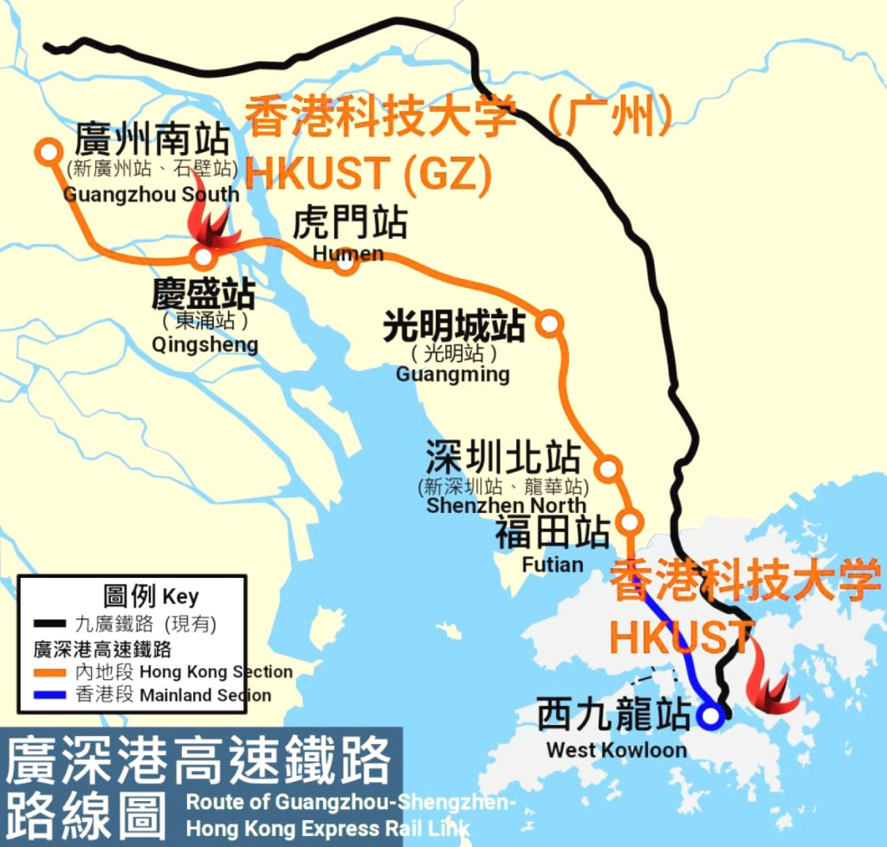
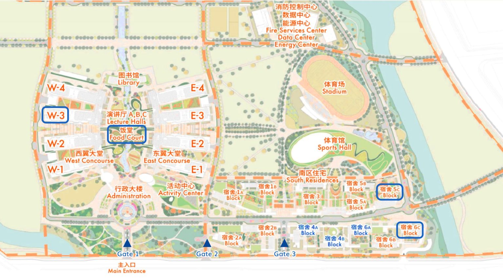

+++
title = "About"
+++

## Directions

### Campus location
Duxue Road, Nansha District, Guangzhou City, Guangdong Province (Postcode: 511458)

[Travel guide (PDF)](https://www.hkust-gz.edu.cn/wp-content/uploads/2023/05/HKUSTGZ-Guidelines-on-Transportation-to-Arrive-on-Campus.pdf)

~~~

~~~

### Get campus entrance permission
If you have someone specific to visit, you could get the entrance permission through WeChat:

- Open WeChat, search and open app "科大 Go".
- Click "访客预约"
- You will be requested to input the empolyee ID and other informations.

### Campus map
~~~

~~~

- Admin office: W3-222
- Guest houses: 5C and 6C
- Green e Materials: W3-4F
- Quantum Science and Technology Center: W3-6F