# Quantum Cellular Automata and its implementation
## 1.Reversible Cellular Automata 

### 1.1Motivation
In theoretical computer science, we have three models of computation that are equivalent and universal. The lambda calculus model is the one that best captures the essence of computation. It achieves so by abstracting the process of computation into function calls. And the unimaginable multitude of universal of computation is achieved through calling and nesting of such elementary functions. The partial recursive function model is the one that is closest to how a modern programmer trained with the imperative programming paradigm perceives computation. The Turing machine model being the one that abstracts the way humans do computation. A piece of data is copied onto an information carrying medium and an object is instructed to modify data upon reading some portion of the medium. 

Such models have done a great job in rigorously modeling the process of computation. But they are not so helpful in improving the efficiency of computation. The reason is that they are not physical in the sense that they don't encapsulate the physical evolution of a system. As the Church-Turing thesis states, no known computation model can simulate the evolution of a physical model faster than the physical evolution itself. Therefore, a model that captures the physical evolution of a system can be used to device a more efficient computation model. 

Reversible Cellular Automata (RCA) is such a model. It is first and foremost a cellular automata, which is a model of computation that captures the concept of locality, a propoerty found in most physical processes. It is reversible in the sense that it is possible to reverse the evolution of the system. The last point is important since reversible processes don't increase entropy. By [Landauer's principle](https://www.cs.princeton.edu/courses/archive/fall06/cos576/papers/bennett03.pdf), all entropy increasing `information bearing operations` must be accompanied with `non-information bearing operations` that increases the entropy with even larger amount. These entropies must be changed with input energy. Hence the irreversible operations are not energy efficient.

### 1.2 Implementation of RCA
The implementation of Reversible Cellular Automata follows from the paper by Margolus et. al. [^1].

An RCA is defined by the following components:

1. A set of states $S$. In our implementation, we limit it to $\{1, 2\}$.
2. A `space` where the cells are located. And, each cell contains a member of the set $S$.
3. A `parity` variable that records the parity of the space. It is used to determine how to group the cells into inputs of a `gate`.

At the time of computation, we provide a function `f1` that determines the output cell state given the input cell states. The function `f1` is a reversible function. It is a function that can be reversed.

The following mapping with all four rotations of them is an example of such a reversible function.

This function is applied to different grouping of cells according to the parity of time step of evolution. At odd time step, the cells in each solid line block are groupped together. At even time step, the cells in each wiggling line block are groupped together.

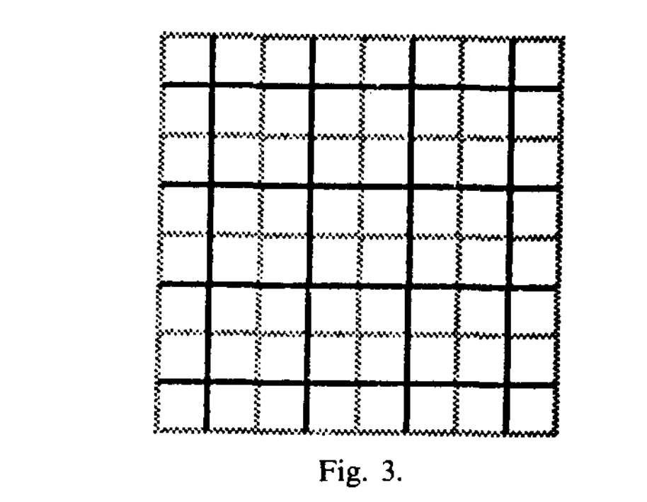

Since the function `f1` is reversible, thei computation model is reversible. The only thing remains to be shown is the universality of such model.

### 1.3 Universality of RCA

The way we show universality of RCA is by first realizing that billiard ball model is universal. And then we show that RCA can simulate billiard ball model.

A billiard ball model is a model of computation that is based on the movement of billiard balls. The trajectory of which the ball moves can be treated as wires. 

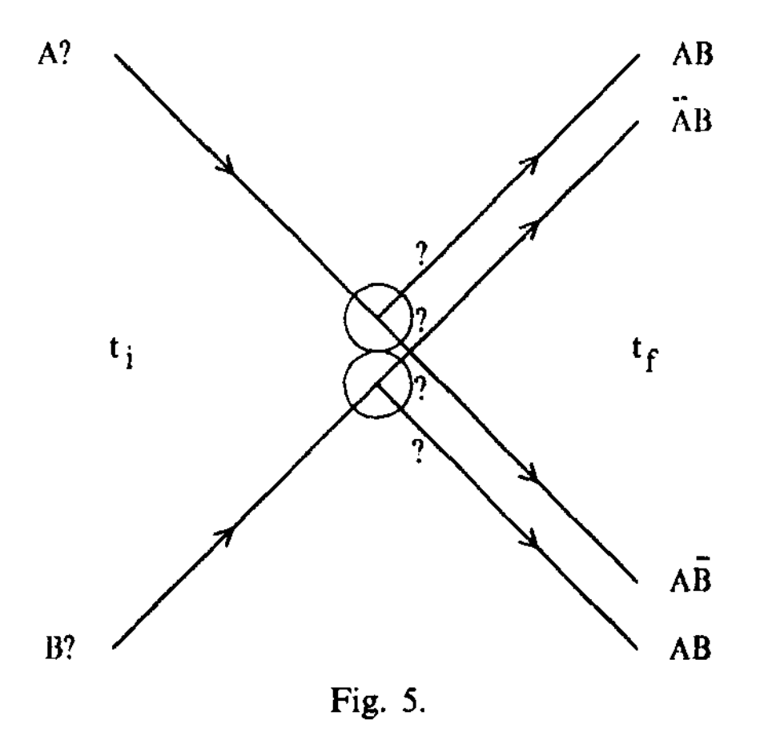

There are mirrors that can change the direction of which the ball moves. 

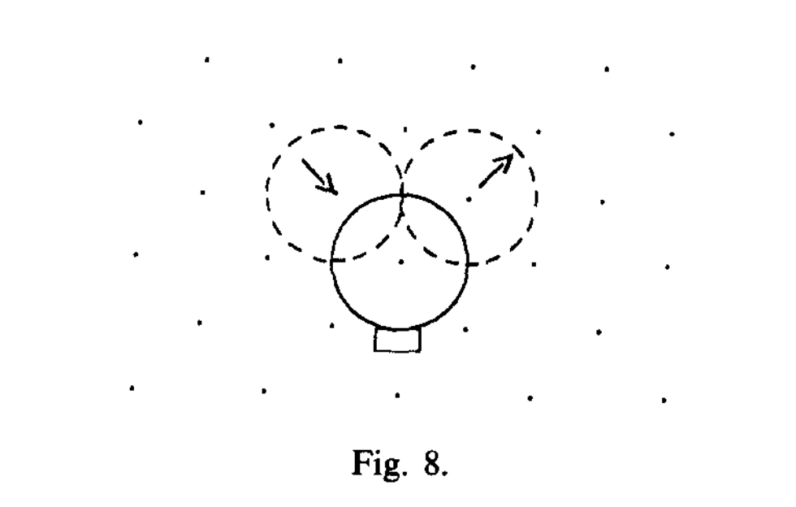

They combine to make a gate. As an example, this [video](https://www.youtube.com/watch?v=7ZEX3yYFUtc&list=PLtIA-JFuqjJV-J5ujaGjTKhiXrqTE_mGZ&index=1) shows how to make an AND gate using billiard balls.

There are also ways to simulate the `OR` and `NOT` gates. Together, the three gates are enough to make a universal computation model. Therefore, the billiard model is universal.

### 1.4 Conversion of Billiard Ball Model to RCA

It is easy to see that RCA can simulate the movement of a billiard ball. We could treat the `1` state of the cell as having a ball there. The following evolution following from our previously defined reversible function `f1` can simulate the movement of the ball. 

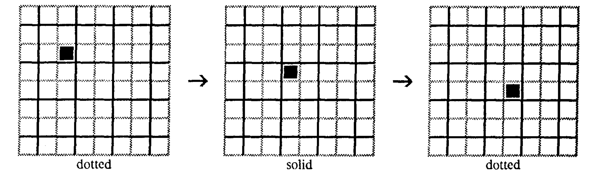

The mirror of the billiard ball model can be simulated by the following evolution.

Another important feature a RCA model needs to have is the ability to do time delay. It is needed for multiple purposes. Firstly, it allows for easier wiring of the ball trajectories. Two trajectories don't have to interact even it they corss each other. This can be done with a time delay in the trajectory of two balls. 

More importantly, it is needed for adjusting the time delay caused by simulation of the billiard ball collision. The time delay occurs at the third and fourth time step of the evolution. It is needed to adjust the time delay caused by the collision of the billiard balls because at the same time other parts of the cellular automata are simulating the computation with no time delay.

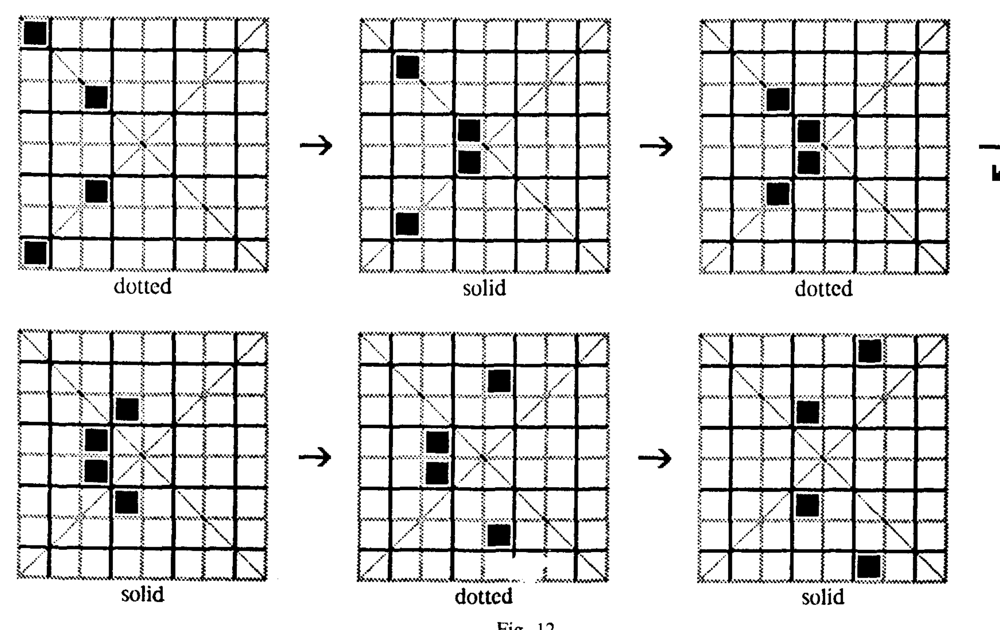

### 2.1 Quantum Cellular Automata
An early way of implementing Quantum Cellular Automata is designed in [^2]. In this paper, the quantum cellular automata has the following definition:

1. Basis States: the possible state in the cell of the automata can be one of the four states: $\{0, 1, \epsilon\}$ or a solid block. The $\{0,1\}$ states vaguely represents moving qubits with state $\ket{0}$ and $\ket{1}$. The $\epsilon$ state represents an empty state. THe solid block is an immobile block that cannot be changed and acts like a reflecting wall in the automata. 

2. World: the world where the automata lives is again a $d$-dimensional lattice. One thing special about the world is that it does not have to be a definite lattice. Much like the quantum state of a qubit, the world can be a coherent superposition of different lattices.

3. Rules: recall our previous discussion on the reversible cellular automata and billiard ball model. The rules necessary to make a reversible and universal computational model requires the following components. 
    a. A moving signal which is realized as below. $s$ can take the value of either $0$ or $1$.
        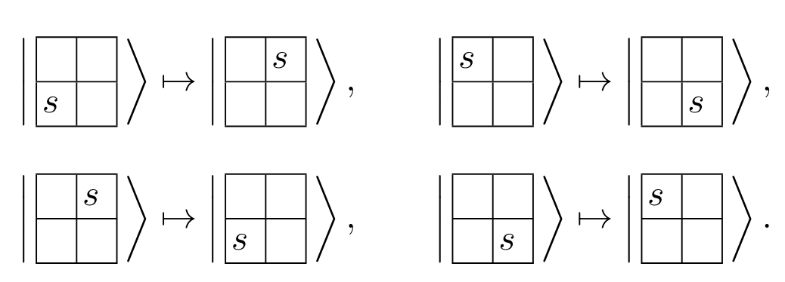

    b. A mirror: this device is realized via the following block
        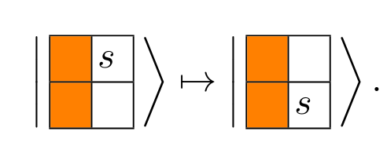
    
    c. The time delay: this is realized via the following block 
        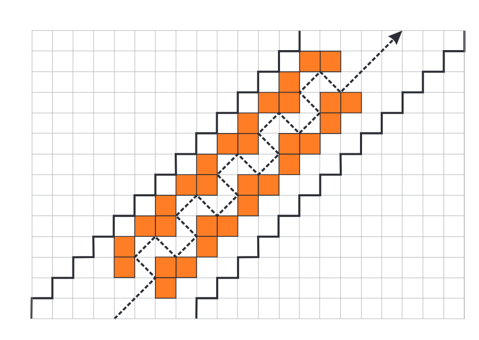

    d. An basis gateset: as per usual in quantum computation, we need a universal basis gateset. The gateset realized in this paper is `H`, $CR(\pi/4)$,  $R(\pi/4)$ and, `SWAP`. It is not hard to see that this gateset is able to compile out another universal gateset of `CNOT`, `H`, and `T`[^3]. The following diagram are the designs to realize `H`, $CR(\pi/4)$, $R(\pi/4)$  and `SWAP` gates respectively.

    Hadamard Gate:
    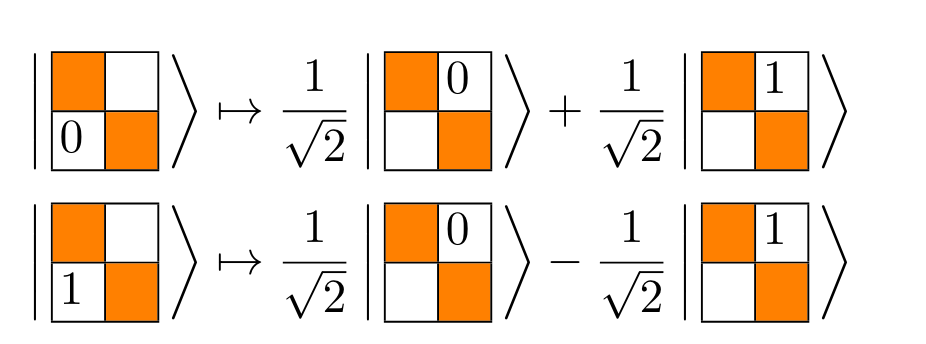

    Phase gate gadget and $CR(\pi/4)$ gate:
    
    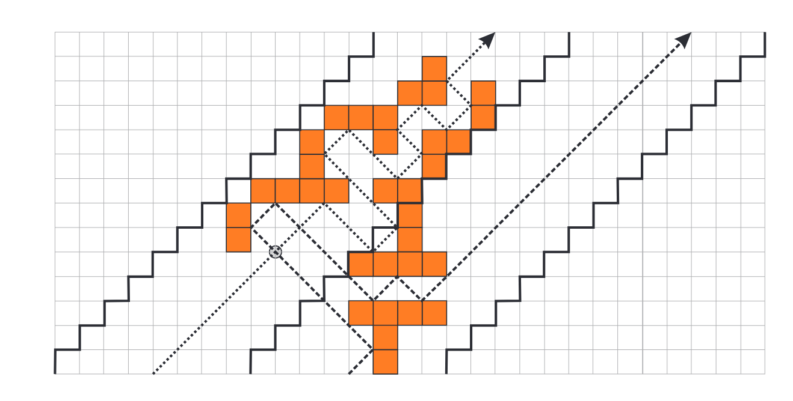

    $R(\pi/4)$ gate:
    

### 2.2 Unitary and non-unitary quantum cellular automata with Rydberg arrays
The current goal is to implement a quantum cellular automaton with desried rules. The platform of choice is Rydberg atoms. The paper [^4] provides a detailed description of an implementation with multiple-frequency excitation and depumping pulses.

The motivation for the use of Rydberg atom is two fold. Firstly, the control of Rydberg atom system is natrually designed to be homogenous spatially. This corresponds well to the homogeneous evolution rule of a cellular automaton model. Secondly, there's a nontrivial dissipative interaction that also does not destroy entanglement [^4]. 

In the following part of this document, we will first describe the physical platform for the quantum cellular automaton. Then we will describe the numerical simulation of the quantum cellular automaton. Finally, we will discuss the potential of the quantum cellular automaton in the higher dimension regime.

### 2.3 Physical platform for quantum cellular automaton 

The physical platform for the QCA is a 1D array of atoms held in optical microtraps with period $a$. The atoms are described as a three-state system: $|g\rangle$, $|r\rangle$ and an additional short lived state |e〉. Our QCA is a two state CA where $|g\rangle$ is the $0$ state and $|r\rangle$ is the $1$ state. For visualization, see figure below.

In order to engineer the desired QCA transition function, we will apply a multifrequency coupling field of the following form 
$\mathcal{E}_j=\mathcal{E}_j^\theta+\mathcal{E}_j^\phi+$ c.c., where
$$
\begin{aligned}
\mathcal{E}_j^\theta & =\frac{1}{2} \sum_k \theta_j^k \mathrm{e}^{i E_r t+i k V t} \\
\mathcal{E}_j^\phi & =\frac{1}{2} \sum_k \phi_j^k \mathrm{e}^{i\left(E_r-E_e\right) t+i k V t}
\end{aligned}
$$

Special attention should be paid to the factor $k$ in the exponent. It does not carry physical meaning inherently in the sense that it is defined to be the sum of two number operators. However, in this special setting (1D atom array, it carries the meaning of number of rydberg states in the neighborhood of an atom.)  The $E_r$ and $E_g$ term means the energy of the Rydberg and ground state respectively. The $V$ term is the nearest-neighbor Rydberg-Rydberg interaction strength. The $\theta_j^k$ and $\phi_j^k$ are the amplitudes of the different frequency components of the driving fields.

The Hamiltonian of the system is given by 

$ \hat{H}(t)=\sum_j \underbrace{\left(\hat{\sigma}_j^{g r} \mathcal{E}_j^\theta(t)+\hat{\sigma}_j^{e r} \mathcal{E}_j^\phi(t)+h . c .\right)+\hat{V}_{\mathrm{int}}}_{\hat{H}_{\mathrm{int}}}+\hat{H}_{\mathrm{atom}},$ 

where $\hat{\sigma}^{a b}=|a\rangle\langle b|, \hat{H}_{\text {atom }}=E_r \hat{\sigma}_j^{r r}+E_e \hat{\sigma}_j^{e e}$. 

We could first go to the rotating frame of the Rydberg atom and apply the rotating wave approximation. The Hamiltonian is simplified to 

$\begin{aligned} \hat{H}(t)=\sum_j & \sum_k\left(\frac{\theta_j^k}{2} \hat{\sigma}_j^{g r} \mathrm{e}^{i k V t}+\frac{\left(\theta_j^k\right)^*}{2} \hat{\sigma}_j^{r g} \mathrm{e}^{-i k V t}\right) \\ & +\left(\frac{\phi_j^k}{2} \hat{\sigma}_j^{e r} \mathrm{e}^{i k V t}+\frac{\left(\phi_j^k\right)^*}{2} \hat{\sigma}_j^{r e} \mathrm{e}^{-i k V t}\right)+V \hat{\sigma}_j^{r r} \hat{\sigma}_{j+1}^{r r} .\end{aligned}$

Then, we could go to the interaction picture of nearest-neighbor Rydberg-Rydberg interaction strength $V$. The Hamiltonian is simplified to

$\begin{aligned} \hat{H} & =\sum_j \sum_k\left(\frac{\theta_j^k}{2} \mathrm{P}_{j-1}^0 \hat{\sigma}_j^{g r} \mathrm{P}_{j+1}^0+\frac{\phi_j^k}{2} \mathrm{P}_{j-1}^0 \hat{\sigma}_j^{e r} \mathrm{P}_{j+1}^0\right) \mathrm{e}^{i k V t} \\ & +\left(\frac{\theta_j^k}{2} \mathrm{P}_{j-1}^0 \hat{\sigma}_j^{g r} \mathrm{P}_{j+1}^1+\frac{\phi_j^k}{2} \mathrm{P}_{j-1}^0 \hat{\sigma}_j^{e r} \mathrm{P}_{j+1}^1\right) \mathrm{e}^{i(k-1) V t} \\ & +\left(\frac{\theta_j^k}{2} \mathrm{P}_{j-1}^1 \hat{\sigma}_j^{g r} \mathrm{P}_{j+1}^0+\frac{\phi_j^k}{2} \mathrm{P}_{j-1}^1 \hat{\sigma}_j^{e r} \mathrm{P}_{j+1}^0\right) \mathrm{e}^{i(k-1) V t} \\ & +\left(\frac{\theta_j^k}{2} \mathrm{P}_{j-1}^1 \hat{\sigma}_j^{g r} \mathrm{P}_{j+1}^1+\frac{\phi_j^k}{2} \mathrm{P}_{j-1}^1 \hat{\sigma}_j^{e r} \mathrm{P}_{j+1}^1\right) \mathrm{e}^{i(k-2) V t} \\ & + \text { h.c. }\end{aligned}$

The $\mathrm{P}_{j}^0$ and $\mathrm{P}_{j}^1$ are the projectors onto the ground and Rydberg states respectively. Due to its close resemblance to the PXP model, this is dubbed as *effective PXP model*. However, it should be noted that the effective PXP model does not inherently prohibit the excitation of blockade state $|r_i,r_{i+1}\rangle$ 

After a few more approximations, we arrive at the time-independent Hamiltonian. 

$\hat{H}^{\prime}=\frac{1}{2} \sum_j \sum_{\alpha, \beta} \mathrm{P}_{j-1}^\alpha\left[\theta_j^k \hat{\sigma}_j^{g r}+\phi_j^k \hat{\sigma}_j^{e r}+\right.$ h.c. $] \mathrm{P}_{j+1}^\beta$

Now, we argue that in the limit of $\phi_j^k >> V > \theta_j^k$, the $|e\rangle$ state will be short lived. And we could treat it as environment that is coupled to the $|r\rangle$ and $|g\rangle$ state non-unitarily.

Finally, we arrive at the Lindblad master equation for describing the overall non-unitary evolution of the system.

$\partial_t \rho=\mathcal{L}[\rho]=-i[\hat{H}, \rho]+\mathcal{D}[\rho]$

where $\hat{H}=\sum_{j, k}\left(\frac{\theta_j^k}{2} e^{i k V t} \hat{\sigma}_j^{g r}+\frac{\phi_j^k}{2} e^{i k V t} \hat{\sigma}_j^{e r}+\right.$ H.c. $)+V \hat{\sigma}_j^{r r} \hat{\sigma}_{j+1}^{r r}$ 

and $\mathcal{D}[\rho]=\sum_j \hat{L}_j \rho \hat{L}_j^{\dagger}-\left(\hat{L}_j^{\dagger} \hat{L}_j \rho+\rho \hat{L}_j^{\dagger} \hat{L}_j\right) / 2$

Now, we are able to simulate the evolution of each atom in the array according to some specific values of $\theta_j^k$ and $\phi_j^k$. This means we could derive the transition function of the quantum cellular automaton from these parameters. As an example, the following figure shows an example of transition rule with the parameter responsible for such transition labeled aside of the arrow. The double sided arrow means the transition is reversible. And, the single sided arrow means the transition is irreversible.

Interested reader should follow [^4] for more details on the derivation of the transition rule.

### 2.4 Evolution of the quantum cellular automaton

There are two modes of evolution for the quantum cellular automaton. The first one is continuous. You simply let the system evolve according to the Lindblad master equation. Such pattern of Rydberg atoms are displayed in the right section of the figure below. The parameters are displayed on the top of each evolution in the format of $[\theta_j^0, \theta_j^1, \theta_j^2, \tilde{\phi_j^0}, \tilde{\phi_j^1},\tilde{\phi_j^2}]$ where $\tilde{\phi_j^k} \approx \phi_j^k/\sqrt{\Gamma}$. The color of each cell represents the $<Z_j>$ expectation of Pauli Z spin on that site.

The second evolution is discrete. It is essentially the blocked evolution rule from [^1]. You let the system evolve according to the transition rule derived from the parameters $\theta_j^k$ and $\phi_j^k$. However, at odd times, you apply the part of the Lindbladian that evolves the atoms on the odd sites. At even times, you apply the part of the Lindbladian that evolves the even site atoms. Such simulation is displayed on the left.  

The simulation is reconstructed in this [repository](https://github.com/exAClior/TinyQCASim.jl) based on QuTip[^5].

### 3.1 Implementation of CA with quantum gates

Previously, we performed numerical simulation of an RCA with cell states corresponding to the $|0\rangle$ and $|1\rangle$ of a Rydberg atom qubit. 

On the right side of the figure, we have transition rules that achieves a transition from computational basis to a superposition of computational basis state. This is evident from the fact that color of the cell is no longer only black and yellow. This means we could implement a QCA with pulse level control. However, this requires some redesign of the exisitng physical platform, we would like to know whether there is a simpler way to implement a QCA with gate level control.

Now, the uncertainty is how to implement an QCA with more than 2 states with a Rydberg qubit system as in the Arrighi et al[^6]. We propose to use two $gg$ Rydberg qubits to represent a cell in the QCA. The four states of the cell are represented by the following states of the two qubits: 

$\epsilon = |gg\rangle$, $|0\rangle = |gg'\rangle$, $|1\rangle = |g'g\rangle$, $\blacksquare = |g'g'\rangle$.

The corresponding notation of states are layedout in the figure below.
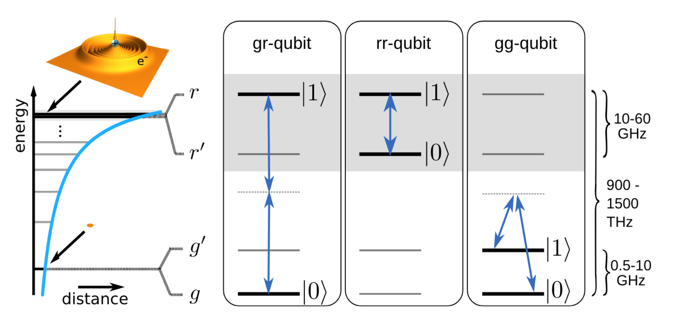

<!-- 
(Actually, there may be schemes in [paper2](https://arxiv.org/pdf/2112.03061.pdf)and [paper1](https://arxiv.org/pdf/2112.03061.pdf) that implements qudits). -->

### 3.2 State Quantum Transition Rules
We propose to implement the $4$-state QCA in Arrighi's paper[^6]. A $4$-state cell could be achieved with $2$ Rydberg atom qubits combined together, each of which will be using $|g\rangle$ and $|g'\rangle$ as computational basis. 

The rules such as 

 would be columns of a $4^4 \times 4^4$ unitary matrix. The problem is that we need to find a way to compile the unitary matrix into a sequence of basis gates. This requires us to do quantum circuit compilation.

For instance, the first rule in the figure above could be represented by the following unitary matrix in dirac notation: $\frac{1}{\sqrt{2}}( |11000111 \rangle + |11001011\rangle) \langle 11010011|$

### 4.1 Circuit Compilation

Quantum Circuit Compilation is the process of converting a $d \times d$ unitary matrix into a sequence of basis gates $\{B\}$. Usually, gates in $\{B\}$ act non-trivially only on $1$ or $2$ qubits. One common example of the basis gateset is $\{H, S, T, CNOT\}$. It is necessary to compile the unitary matrix into a sequence of basis gates because the error correction is only possible when the we don't have a continuous degree of freedom to control on basis gates. Because it would require infinite amount of information to exacly know and fix the gate that is implemented with error.

The classical method of doing this is layed out in Chapter 4.5 in Nielson and Chuang[^3]. 

### 4.2 Classical Method
In this section, we give a constructive proof of how to decompose a $d \times d$ unitary matrix into a sequence of $2-level$ unitaries.  

We claim that any $d \times d$ unitary matrix $U$ can be decomposed into a sequence of $2$-level unitaries, $U_i^{\dagger}$. 
I.e  $\prod_i U_i^{\dagger} = U$.

A two level unitary is a unitary matrix that acts non-trivially only on the subspace spanned by two computational basis states. For example, the following matrix is a $2$-level unitary that acts only on the subspace spanned by $|0\rangle$ and $|1\rangle$:

$$
U_1 \equiv\left[\begin{array}{ccc}
\frac{a^*}{\sqrt{|a|^2+|b|^2}} & \frac{b^*}{\sqrt{|a|^2+|b|^2}} & 0 \\
\frac{b}{\sqrt{|a|^2+|b|^2}} & \frac{-a}{\sqrt{|a|^2+|b|^2}} & 0 \\
0 & 0 & 1
\end{array}\right] .
$$

The purpose of such $2$-level unitaries is to act non-trivially only on the subspace spanned by two computational basis states.

For the sake of simplicity in explaination, let's assume that such subspaces are spanned by the two states $|0aaaaa\rangle$ and $|1aaaaa\rangle$. I.e in the subspace of the first qubit. Any $2$-level unitary acts trivially on the other qubits. Therefore, the $2$-level unitary is a tensor product of a $2 \times 2$ unitary matrix and the identity matrix on other matrices. We could always visualize the $2 \times 2$ matrix as a rotation in the Bloch sphere. 

The number of $2$-level unitaries required to decompose a $d \times d$ unitary matrix is $O(d^2)$. Naively, we need to do a rotation that zeros out each off-diagonal terms.

Here we introduce how to simulate general contral-U gates,we will introduce the notation and lemma that we will use in the following part.

**Notation:**
$\mathrm{R}_{\mathrm{y}}(\theta)=\left(\begin{array}{rr}\cos \theta / 2 & \sin \theta / 2 \\ -\sin \theta / 2 & \cos \theta / 2\end{array}\right)$ (a rotation by $\theta$ around $\left.\hat{y}\right)$
$\mathrm{R}_{\mathrm{z}}(\alpha)=\left(\begin{array}{ll}e^{i \alpha / 2} & 0 \\ 0 & e^{-i \alpha / 2}\end{array}\right)($ a rotation by $\alpha$ around $\hat{z})$.
$\operatorname{Ph}(\delta)=\left(\begin{array}{ll}e^{i \delta} & 0 \\ 0 & e^{i \delta}\end{array}\right)$ (a phase-shift with respect to $\delta$ ).
$\sigma_x=\left(\begin{array}{ll}0 & 1 \\ 1 & 0\end{array}\right)$ (a "negation", or Pauli matrix).
$I=\left(\begin{array}{ll}1 & 0 \\ 0 & 1\end{array}\right)$ (the identity matrix).

**Lemma 1**: The following properties hold:
1. $\mathrm{R}_{\mathrm{y}}\left(\theta_1\right) \cdot \mathrm{R}_{\mathrm{y}}\left(\theta_2\right)=\mathrm{R}_{\mathrm{y}}\left(\theta_1+\theta_2\right)$
2. $\mathrm{R}_{\mathrm{z}}\left(\alpha_1\right) \cdot \mathrm{R}_{\mathrm{z}}\left(\alpha_2\right)=\mathrm{R}_{\mathrm{z}}\left(\alpha_1+\alpha_2\right)$
3. $\operatorname{Ph}\left(\delta_1\right) \cdot \operatorname{Ph}\left(\delta_2\right)=\operatorname{Ph}\left(\delta_1+\delta_2\right)$
4. $\sigma_x \cdot \sigma_x=I$
5. $\sigma_x \cdot \mathrm{R}_{\mathrm{y}}(\theta) \cdot \sigma_x=\mathrm{R}_{\mathrm{y}}(-\theta)$
6. $\sigma_x \cdot \mathrm{R}_{\mathrm{z}}(\alpha) \cdot \sigma_x=\mathrm{R}_{\mathrm{z}}(-\alpha)$

**Lemma 2（ZYZ Decompostition）**: Every unitary $2 \times 2$ matrix can be expressed as
$$
\left(\begin{array}{ll}
e^{i \delta} & 0 \\
0 & e^{i \delta}
\end{array}\right) \cdot\left(\begin{array}{ll}
e^{i \alpha / 2} & 0 \\
0 & e^{-i \alpha / 2}
\end{array}\right) \cdot\left(\begin{array}{rl}
\cos \theta / 2 & \sin \theta / 2 \\
-\sin \theta / 2 & \cos \theta / 2
\end{array}\right) \cdot\left(\begin{array}{ll}
e^{i \beta / 2} & 0 \\
0 & e^{-i \beta / 2}
\end{array}\right),
$$ where $\delta, \alpha, \theta$, and $\beta$ are real-valued. Moreover, any special unitary $2 \times 2$ matrix (i.e., with unity determinant) can be expressed as
$$
\left(\begin{array}{ll}
e^{i \alpha / 2} & 0 \\
0 & e^{-i \alpha / 2}
\end{array}\right) \cdot\left(\begin{array}{rr}
\cos \theta / 2 & \sin \theta / 2 \\
-\sin \theta / 2 & \cos \theta / 2
\end{array}\right) \cdot\left(\begin{array}{ll}
e^{i \beta / 2} & 0 \\
0 & e^{-i \beta / 2}
\end{array}\right) =\mathrm{R}_{\mathrm{z}}(\alpha) \cdot \mathrm{R}_{\mathrm{y}}(\theta) \cdot \mathrm{R}_{\mathrm{z}}(\beta) .
$$

**Lemma 3**: For any special unitary matrix $W(W \in S U(2))$, there exist matrices $A, B$, and $C \in S U(2)$ such that $A \cdot B \cdot C=I$ and $A \cdot \sigma_x \cdot B \cdot \sigma_x \cdot C=W$

Proof: By Lemma 2, there exist $\alpha, \theta$, and $\beta$ such that $W=\mathrm{R}_{\mathrm{z}}(\alpha) \cdot \mathrm{R}_{\mathrm{y}}(\theta) \cdot \mathrm{R}_{\mathrm{z}}(\beta)$.
Set $A=\mathrm{R}_{\mathrm{z}}(\alpha) \cdot \mathrm{R}_{\mathrm{y}}\left(\frac{\theta}{2}\right), B=\mathrm{R}_{\mathrm{y}}\left(-\frac{\theta}{2}\right) \cdot \mathrm{R}_{\mathrm{z}}\left(-\frac{\alpha+\beta}{2}\right)$, and $C=\mathrm{R}_{\mathrm{z}}\left(\frac{\beta-\alpha}{2}\right)$. Then
$$
\begin{aligned}
A \cdot B \cdot C & =\mathrm{R}_{\mathrm{z}}(\alpha) \cdot \mathrm{R}_{\mathrm{y}}\left(\frac{\theta}{2}\right) \cdot \mathrm{R}_{\mathrm{y}}\left(-\frac{\theta}{2}\right) \cdot \mathrm{R}_{\mathrm{z}}\left(-\frac{\alpha+\beta}{2}\right) \cdot \mathrm{R}_{\mathrm{z}}\left(\frac{\beta-\alpha}{2}\right) \\
& =\mathrm{R}_{\mathrm{z}}(\alpha) \cdot \mathrm{R}_{\mathrm{z}}(-\alpha) \\
& =I
\end{aligned}
$$

**Theorem 1**: For any unitary $2 \times 2$ matrix $W$, a contral-$(W)$ gate can be simulated by a network of the form,where $A, B$, and $C \in S U(2)$, if and only if $W \in S U(2)$.
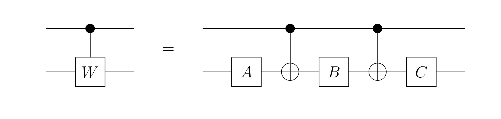
Proof: For the "if" part, let $A, B$, and $C$ be as in Lemma 3. If the value of the first (top) bit is 0 then $A \cdot B \cdot C=I$ is applied to the second bit. If the value of the first bit is 1 then $A \cdot \sigma_x \cdot B \cdot \sigma_x \cdot C=W$ is applied to the second bit.
For the "only if" part, note that $A \cdot B \cdot C=I$ must hold if the simulation is correct when the first bit is 0 . Also, if the network simulates a contral$(W)$ gate then $A \cdot \sigma_x \cdot B \cdot \sigma_x \cdot C=W$. Therefore, since $\operatorname{det}\left(A \cdot \sigma_x \cdot B \cdot \sigma_x \cdot C\right)=1, W$ must also be special unitary.

### 4.3 Advanced Method & Decompose to 2-level unitaries 
A brief search on the internet shows that this is still the state-of-the-art method for quantum circuit compilation without considering topology and noise.
Firstly, we will decompose $256 \times 256$ unitary matrix, $U$, into a sequence of $2$-level matrices. 

There are various ways of doing it. 

We don't recommend the following [method](https://arxiv.org/pdf/2304.14096.pdf) because it is a costly optimization based one with no guarantee of the circuit depth.

[Cartan's KAK decomposition](https://arxiv.org/pdf/quant-ph/0507171.pdf) and [realization](https://quantumai.google/reference/python/cirq/kak_decomposition)

Rather, let's approach this problem with there different decomposition methods. In general, they will decompose the unitary matrix into a sequence of $2$-level unitaries.

Some collection of literature are listed here approximately chronologically:

1. [Aram Harrow' PhD thesis](https://cba.mit.edu/docs/theses/01.05.aram.pdf). This is a good starting point but perhaps too old.
 
2. [An early synthesis algorithm](https://arxiv.org/pdf/quant-ph/0404089.pdf)

3. [The most promising implementation](https://arxiv.org/pdf/2101.02993.pdf)
### 4.4 Optimization

We could try to optimize the compiled gates specifically for the Rydberg atom system. For example, try to following [this](https://arxiv.org/pdf/2306.03487.pdf) paper.

Furthermore, we could try to optimize the compiled gates for the Rydberg atom system. Due to its current worst quality and requirement for optimization on the topology level, we set the number of [CNOT](https://arxiv.org/pdf/quant-ph/0308033.pdf) as the target for optimization. Note that there's an lower bound for the number of CNOT used in an $n$-qubit gate $\frac{1}{4}(4^n - 3n - 1)$, please see proof in the previous link.

### 5.1 Universal Quantum Gates and Generic Gates
In the study of classical computation (reversible and irreversible), it has been proven that any function operation can be decomposed into a combination of a finite number of basic gates[^7]. In other words, by constructing universal logic gates, any function calculation can be realized. The combination of basic gates forms a circuit model, and the scale of the basic gates naturally gives the circuit complexity of the corresponding computation.[^14]
>Universality of classical logic gates: The combination of classical **universal** logic gates can accurately obtain any Boolean function.

>Universality of quantum logic gates: Quantum circuits generated through cascading universal gates can approximate any unitary transformation in an $n$-qubit space to any desired precision.

##### Definition1: If $\frac{a}{b}$ is a rational number, then a and b are called commensurate; otherwise, they are called incommensurate.
From the properties of real numbers, we can obtain the following lemma:
##### Lemma1: If the angle $\theta$ in $e^{i \theta}$ is incommensurate with $\pi$, then $e^{i n \theta}$ $(n=1,2, \cdots, \infty)$ is dense on the unit circle in the complex plane[^12]
**Proof：**
The incommensurability of $\theta$ and $\pi$ implies that $\theta / \pi$ is irrational. By contradiction, if $\theta=\frac{p}{q} \pi$ ($p, q$ are integers, and any number that can be written as a fraction is rational), then, by the periodicity of the function $e^{i a}$, we know that $e^{i 2 q \theta}=e^{i 2 p \pi}=1$. $e^{i n \theta}$ $(n=1,2, \cdots)$ is periodic, and it can only cover a finite number of points on the unit circle, so it cannot be dense (denseness implies that it can be arbitrarily close to any point $e^{i \Phi}$ on the unit circle using a sequence $e^{i f(n) \theta}$, where $f(n)$ is a function of the natural number $n$). (Generic gates can be seen as a generalization of this property on unitary matrices).

Any unitary transformation $U$ can be similar to this diagonal form (in the corresponding eigenstate representation[^9]）:
$$
U_g=\left[\begin{array}{llll}
e^{i \theta_1} & & & \\
& e^{i \theta_2} & & \\
& & \ddots & \\
& & & e^{i \theta_{2^k}}
\end{array}\right]
$$

**Definition: If a unitary transformation satisfies the following two constraints, it is called a k-qubit generic gate (denoted as $U_g$)**
 (1) All $\theta_i$ are incommensurate with $\pi$.
 (2)Any two $\theta_i$ and $\theta_j(i \neq j)$ are incommensurate with each other.

The first condition is consistent with the condition in Lemma 1, which ensures that each $e^{i n \theta_j}$ $(n=1,2, \cdots, \infty)$ is dense on the corresponding unit circle. The second condition ensures that different $e^{i \theta_j}$ are unrelated and independent of each other. If the diagonal elements of the positive integer powers $U_g^n$ of the generation gate $U_g$ $\left(e^{i n \theta_1}, e^{i n \theta_2}, \cdots, e^{i n \theta_{2^k}}\right)$ are viewed as points on a $2^k$ -dimensional torus, then as $n$ increases from 1, these points move on the $2^k$ -dimensional torus. As $n \Longrightarrow \infty$, these points gradually become dense, meaning for any point $\left(e^{i \alpha_1}, e^{i \alpha_2}, \cdots, e^{i \alpha_{2^k}}\right)$, there exists an infinite sequence $\left\{U_g^{m_1}, U_g^{m_2}, \cdots, U_g^{m_i}, \cdots\right\}$ such that $\left(e^{i m_j \theta_1}, e^{i m_j \theta_2}, \cdots, e^{i m_j \theta_{2^k}}\right)$ (as $m_j$ tends to infinity) can approximate $\left(e^{i \alpha_1}, e^{i \alpha_2}, \cdots, e^{i \alpha_{2^k}}\right)$ arbitrarily closely.

##### Lemma 2: If $U_1=e^{i A}, U_2=e^{i B}$ ($A, B$ is Hermitian) are generating gates, then any unitary transformation $e^{i L}$ can be generated by their concatenation, where $L$ is any element in the Lie algebra $\mathcal{L}(A, B)$ generated by the operators $A, B$.
**Proof：This is equivalent to proving the following two facts:**
(1) Any unitary transformation $e^{i(\alpha A+\beta B)}$ (where $\alpha, \beta$ are arbitrary real numbers) can be approximated arbitrarily closely by cascading the generating gates $U_1$ and $U_2$. 
(2) Any unitary transformation $e^{-\gamma[A, B]}$ (where $\gamma$ is an arbitrary real number) can be approximated arbitrarily closely by cascading the generating gates $U_1$ and $U_2$. Since $U_1$ is a generating gate, there exists a series of powers of $U_1$.
$$
e^{i f(1) A}, e^{i f(2) A}, \cdots, e^{i f(j) A}, \cdots
$$

Any unitary transformation $U_1(\lambda)=e^{i \lambda A}$ (where $\lambda$ is an arbitrary real number) can be approximated arbitrarily closely. Similarly, the unitary transformation $U_2(\lambda)=e^{i \lambda B}$ (where $\lambda$ is an arbitrary real number) can also be approximated by powers of $U_2$. Based on this, we have:
$$
\begin{aligned}
e^{i(\alpha A+\beta B)} & =\lim _{n \Longrightarrow \infty}\left[e^{i \frac{\alpha A+\beta B}{n}}\right]^n \\
& =\lim _{n \Longrightarrow \infty}\left(1+i \frac{\alpha A+\beta B}{n}\right)^n \\
& =\lim _{n \Longrightarrow \infty}\left[\left(1+i \frac{\alpha A}{n}\right)\left(1+i \frac{\beta B}{n}\right)\right]^n\\
& =\lim _{n \Longrightarrow \infty}\left(e^{i \frac{\alpha A}{n}} e^{i \frac{\beta B}{n}}\right)^n
\end{aligned}
$$

Therefore, $e^{i(\alpha A+\beta B)}$ can be generated by concatenating $e^{i \frac{\alpha}{n} A}$ (generated by powers of $U_1$) and $e^{i \frac{\beta}{n} B}$ (generated by powers of $U_2)$. This proves the first fact. As for the second fact, we similarly have:
$$
\begin{aligned}
e^{-\gamma[A, B]} & =\lim _{n \Longrightarrow \infty}\left[e^{\frac{-\gamma[A, B]}{n}}\right]^n \\
& =\lim _{n \Longrightarrow \infty}\left[1-\frac{\gamma}{n}(A B-B A)\right]^n \\
& =\lim _{n \Longrightarrow \infty}\left(e^{i \sqrt{\frac{\gamma}{n}} A} e^{i \sqrt{\frac{\gamma}{n}} B} e^{-i \sqrt{\frac{\gamma}{n}} A} e^{-i \sqrt{\frac{\gamma}{n}} B}\right)^n
\end{aligned}
$$

Therefore, $e^{-\gamma[A, B]}$ can also be generated by concatenating $U_1$ and $U_2$.
It can be seen that any unitary transformation corresponding to an arbitrary linear combination of operators $A,B$, and the commutator $[A, B]$, can be generated by concatenating the generating gates $U_1, U_2$. More generally, by iteratively performing commutation operations on the operators (such as $[[A, B], A],[[[A, B], A], A], \cdots$), until the entire set of operators is closed (i.e., no new operators are produced by commutation), a closed Lie algebra $\mathcal{L}(A, B)$ generated by the operators $A$ and $B$ is formed. Therefore, any unitary transformation $e^{i L}$ corresponding to any operator $L$ in the Lie algebra $\mathcal{L}(A, B)$ can be realized by concatenating the generating gates $e^{i A}$ and $e^{i B}$.

If a logical gate $M$ can be arbitrarily approximated by concatenating a set of generating gates $e^{i \theta A_k}$ (where $k=1,2, \cdots, n$), then $M$ can generate the unitary transformation $e^{i \mathcal{L}}$ corresponding to the entire Lie algebra $\mathcal{L}\left(A_1, A_2, \cdots, A_n\right)$. In particular, if any Hermitian operator in an $n$-qubit system is in $\mathcal{L}\left(A_1, A_2, \cdots, A_n\right)$, then the logical gate $M$ can generate all unitary transformations on the $n$ qubits. Therefore, $M$ is a universal quantum logical gate.

### 5.2 Clifford Group*

To define the Clifford operator, we first define the Pauli group $\mathcal{P}_1$ on a single qubit, which is defined as the group generated by the operators $\left\{i, \sigma^x, \sigma^z\right\}$ through multiplication, and it contains a total of 16 elements:
$$
\left\{ \pm I, \pm \sigma^x, \pm \sigma^y, \pm \sigma^z, \pm i I, \pm i \sigma^x, \pm i \sigma^y, \pm i \sigma^z\right\}
$$
The Pauli group $\mathcal{P}_n$ on $n$ qubits is defined as follows: 
$$
\left\langle i, \sigma_1^x, \sigma_1^z, \sigma_2^x, \sigma_2^z, \cdots, \sigma_n^x, \sigma_n^z\right\rangle .
$$

Therefore, the Clifford group on the Pauli group $\mathcal{P}_n$ is defined as follows: 
**Definition： (Clifford group) If the $n$-qubit operator $g \in \mathrm{SU}\left(2^n\right)$ satisfies the condition for any element $p \in \mathcal{P}_n$ in the Pauli group such that[^13]
$$
g p g^{-1} \in \mathcal{P}_n
$$**

then the operator $g$ is called an $n$-qubit Clifford operator. All Clifford operators $g$ form a group structure, known as the $n$-qubit Clifford group.[^11][^12]
(The coefficients in front of the elements do not play a role when considering the commutation relations of Pauli group elements). In this case, the elements of the Pauli group can be represented by the generators $\sigma_i^x, \sigma_i^z$ .
**Table 1:Closure of the Pauli Group under Clifford Action**

The first column on the left represents single-qubit Pauli operators, the first row at the top represents single-qubit Clifford operators, and the table below shows the results of the Clifford operators acting on the corresponding Pauli operators. It can be observed that the Pauli operators remain in the Pauli group after the Clifford action.
| Pauli $\backslash$ Clifford | $\sigma^x$ | $\sigma^z$ | $\sqrt{i \sigma^x}$ | $\sqrt{i \sigma^y}$ | $\sqrt{i \sigma^z}$ | $H$ | $S$ |
| :---: | :---: | :---: | :---: | :---: | :---: | :---: | :---: |
| $\sigma^x$ | $\sigma^x$ | $-\sigma^x$ | $\sigma^x$ | $\sigma^z$ | $-\sigma^y$ | $\sigma^z$ | $\sigma^y$ |
| $\sigma^y$ | $-\sigma^y$ | $-\sigma^y$ | $-\sigma^z$ | $\sigma^y$ | $\sigma^x$ | $-\sigma^y$ | $-\sigma^x$ |
| $\sigma^z$ | $-\sigma^z$ | $\sigma^z$ | $\sigma^y$ | $-\sigma^x$ | $\sigma^z$ | $\sigma^x$ | $\sigma^z$ |

By utilizing the properties of Pauli operators, it is straightforward to verify the correctness of the operations in the table. In particular, the Clifford operator can be expressed as: 
$$
\sqrt{i \sigma^k}=e^{i \frac{\pi}{4} \sigma^k}=\frac{\sqrt{2}}{2}\left(I+i \sigma^k\right), \quad k=x, y, z
$$

Next, we will examine the Clifford properties of the CNOT gate. The CNOT gate can be represented in operator form as:
$$
\mathrm{CNOT}=\frac{1}{2}\left(I \otimes I+\sigma^z \otimes I+I \otimes \sigma^x-\sigma^z \otimes \sigma^x\right)
$$

**Table 2: Some typical transformations of two-qubit Pauli operators under the action of the CNOT gate are provided.**
The typical transformation of two-qubit Pauli operators under the CNOT gate is as follows: the first four operators are the basic operators, and the other operators can be generated through the multiplication of these basic operators. For example, the result of the operator $\sigma^y \otimes \sigma^y$ after passing through the CNOT gate can be obtained through the product of the first four operators.

| Clifford $\backslash$ Pauli | $\sigma^x \otimes I$ | $\sigma^z \otimes I$ | $I \otimes \sigma^x$ | $I \otimes \sigma^z$ | $\sigma^y \otimes \sigma^y$ |
| :---: | :---: | :---: | :---: | :---: | :---: |
| $\mathrm{CNOT}$ | $\sigma^x \otimes \sigma^x$ | $\sigma^z \otimes I$ | $I \otimes \sigma^x$ | $\sigma^z \otimes \sigma^z$ | $\sigma^x \otimes \sigma^z$ |

From Table 2, it can be observed that when the control qubit contains the operator $\sigma^x$ it will propagate to the target qubit through the CNOT gate, while the operator $\sigma^z$ will not propagate to the target qubit. Conversely, when the target qubit contains the operator $\sigma^z$, the CNOT gate will propagate it to the control qubit, whereas the operator $\sigma^x$ will not propagate to the control qubit. The distinct actions of the CNOT gate on the operators $\sigma^x$ and $\sigma^z$ for the control and target qubits play a crucial role in fault-tolerant quantum computation.

For an $n$-qubit system, we have the following theorem for the Clifford group: 
**Theorem: The $n$-qubit Clifford group can be generated by single-qubit $S$ gates, $H$ gates, and two-qubit CNOT gates.**
While Clifford operators have many elegant properties, including only Clifford gates is not sufficient to achieve universal quantum computation. Therefore, we will introduce the well-known Gottesman-Knill theorem.

### 5.3 The Gottesman-Knill theorem and its proof
#### Theorem：（Gottesman-Knill Theorem）If a quantum circuit consists only of the following operations[^11][^13]：
（1）Preparation of the initial state in the computational basis;
（2） Clifford gates;
（3）Measurements in the computational basis,
then, this quantum circuit can be efficiently simulated by a classical computer.
**Proof：**
Let $C_n$ be a quantum circuit composed of Clifford gates, corresponding to the Clifford operator $U$ .According to condition (1), the input quantum state $\left|\phi_0\right\rangle$ of this quantum circuit $C_n$ needs to be prepared in the computational basis. Without loss of generality, we assume $\left|\phi_0\right\rangle=\left|0^n\right\rangle$ (if the input state on some qubits is $|1\rangle$, we only need to add a $\sigma^x$ gate at the corresponding qubit input position in the circuit $C_n$ to form a new circuit $C_n^{\prime}$). It is worth noting that the initial state $\left|\phi_0\right\rangle=\left|0^n\right\rangle$ satisfies the eigenvalue equation $\sigma_i^z\left|\phi_0\right\rangle=\left|\phi_0\right\rangle(i=1,2, \cdots, n)$; in other words, $\left|\phi_0\right\rangle=\left|0^n\right\rangle$ is the unique common eigenstate with eigenvalue 1 of $\sigma_i^z(i=1,2, \cdots, n)$. The output state (final state) $\left|\phi_f\right\rangle$ of $C_n$ satisfies the following equation:
$$
\left|\phi_f\right\rangle=U\left|0^n\right\rangle=U \sigma_i^z U^{\dagger} U\left|0^n\right\rangle \quad(i=1,2, \cdots, n)
$$

This indicates that the final state $\left|\phi_f\right\rangle$ is the unique common eigenstate with eigenvalue +1 of the Pauli operator $Q_i=U \sigma_i^z U^{\dagger} \quad(i=1,2, \cdots, n)$ (where $Q_i$ commute with each other and are mutually independent).
To effectively simulate the quantum circuit $C_n$, it is necessary to be able to efficiently compute the probability of the output quantum state $\left|\phi_f\right\rangle$ in any computational basis $|x\rangle$.Without loss of generality, let $|x\rangle=\left|0^n\right\rangle$ (if the quantum state of some qubits in the computational basis $|x\rangle$ is $|1\rangle$, it is only necessary to add a $\sigma^x$ gate at the output position of the corresponding qubits in the quantum circuit $C_n$ to form a new circuit $C_n^{\prime}$). Since simultaneous measurements and individual measurements do not affect the final distribution probability, without loss of generality, we discuss the measurements in a bit-by-bit manner.
(1) The commutation relations between the operators $\sigma_1^z, \sigma_2^z, \cdots$ and the operators in the set $\left\{Q_i\right\}$ are sequentially considered. Let $\sigma_{a_1}^z$ be the first $\sigma^z$ operator that has a commutation relation with some operators in the set $\left\{Q_i \mid i=1,2, \cdots, n\right\}$.

In other words, all operators in the set$\left\{Q_i \mid i=\right.$ $1,2, \cdots, n\}$ commute with the operators $\sigma_j^z$ when $j<a_1$, let the operators in$\left\{Q_i \mid i=1,2, \cdots, n\right\}$ which commute with $\sigma_{a_1}^z$ form the set $\mathcal{S}_1$, and the operators commute with $\sigma_{a_1}^z$ form the set $\mathcal{S}_2$ .Since $\mathcal{S}_1$ is not empty, let's assume $Q_k \in \mathcal{S}_1$ and $|\phi\rangle$ be the common eigenstate (the output quantum state) of  $\left\{Q_i(i=1,2, \cdots, n)\right\}$ with eigenvalue $1$, then we have:
$$
\begin{aligned}
& \left\langle\phi\left|\sigma_{a_1}^z\right| \phi\right\rangle=\left\langle\phi\left|\sigma_{a_1}^z Q_k\right| \phi\right\rangle \\
& \left(|\phi\rangle \text { is
 the eigenstate of } Q_k \text { with eigenvalue } 1\right.  \\
& =\left\langle\phi\left|-Q_k \sigma_{a_1}^z\right| \phi\right\rangle \quad\left(Q_k \text { anticommutes with } \sigma_{a_1}^z \right) \\
& =\left\langle\phi\left|-\sigma_{a_1}^z\right| \phi\right\rangle \quad\left(Q_k=Q_k^{\dagger}\right) \\
& =0
\end{aligned}
$$
Therefore, the probability of measuring qubit $a_1$ and obtaining the quantum state $|0\rangle$ is:
$$
\mathbb{P}_1(0)=\langle\phi \mid 0\rangle_{a_1}\langle 0 \mid \phi\rangle=\left\langle\phi\left|\frac{I+\sigma_{a_1}^z}{2}\right| \phi\right\rangle=\frac{1}{2}+\left\langle\phi\left|\sigma_{a_1}^z\right| \phi\right\rangle=\frac{1}{2}
$$

After measuring qubit $a_1$ along the $\sigma^z$ direction, suppose it is in the quantum state $|0\rangle$ and in a tensor product state with the other qubits. The quantum state of the system at this time is denoted as $\left|\phi^1\right\rangle=|0\rangle_{a_1}\langle 0 \mid \phi\rangle$ (not normalized).

Based on the operators $\left\{Q_i\right\}$, a new set of operators $Q_i^1(k=1,2, \cdots, n)$ is defined such that the quantum state $\left|\phi^1\right\rangle$ after measurement is the common eigenstate with eigenvalue 1. To achieve this, construct the set $\left\{Q_i^1\right\}$ as follows:
- Choose any operator $Q_k$ from $\mathcal{S}_1$ (its ordering index in the set of operators $\left\{Q_i\right\}$ is denoted as $k$), then the corresponding operator with the same ordering index in the set $\left\{Q_i^1\right\}$ is defined as $Q_k^1=\sigma_{a_1}^z$;
- For the operator $Q_{l \neq k} \in \mathcal{S}_1$, the corresponding operator in $\left\{Q_i^1\right\}$ (with ordering index 1) is constructed as $Q_l^1=$ $Q_k Q_l$;
- For the operator $Q_i \in \mathcal{S}_2$, the corresponding operator in $\left\{Q_i^1\right\}$ is defined as $Q_i^1=Q_i$ (with ordering index $i$).

This results in $n$ mutually independent operators $\left\{Q_i^1 \mid i=1,2, \cdots, n\right\}$. Direct calculation shows that the measured quantum state $\left|\phi^1\right\rangle$ is indeed the common eigenstate of these operators, with eigenvalue 1.

(2) Repeat the previous steps and continue to investigate the anti-commutation relations between $\sigma_1^z, \cdots, \sigma_n^z$ and operators in $\left\{Q_i^1\right\}$. Find the first $\sigma_{a_2}^z$ that anti-commutes with certain operators in $\left\{Q_i^1\right\}$. Measure the quantum bit numbered $a_2$ and the probability of obtaining $|0\rangle$ is still $\frac{1}{2}$.
Let the post-measurement quantum state be $\left|\phi^2\right\rangle=|0\rangle_{a_2}\left\langle 0 \mid \phi^1\right\rangle$. Use the same method to construct operators $Q_k^2(k=1,2, \cdots, n)$ such that $\left|\phi^2\right\rangle$ is a common eigenstate with eigenvalue 1 for these operators.

(3) Repeat this operation $m$ times until every $\left\{Q_i^m \mid i=1,2, \cdots, n\right\}$. Specifically, the Pauli operators $\sigma_{a_i}^z(i=1,2, \cdots, m)$ measured on the qubits are all included in the operator set $\left\{Q_i^m \mid i=1,2, \cdots, n\right\}$. Note that each operator in $\left\{Q_i^m \mid i=1,2, \cdots, n\right\}$ commutes with $\sigma_i^z$ $(i=1,2, \cdots, n)$. Therefore, they can be generated by the operators $\sigma_i^z(i=1,2, \cdots, n)$. In other words, $\left\{Q_i^m \mid i=1,2, \cdots, n\right\}$ generates the same group as $\sigma_i^z(i=1,2, \cdots, n)$.

Following the previous construction method, the quantum state at this point, $\left|\phi^m\right\rangle$, is a common eigenstate with eigenvalue 1 for the operators $\left\{Q_i^m \mid i=1,2, \cdots, n\right\}$. According to stabilizer theory[^14], this quantum state can be expressed as the average of all elements in the stabilizer subgroup generated by the operators $\left\{Q_i^m \mid i=1,2, \cdots, n\right\}$, i.e.
$$
\rho^m=\frac{1}{2^n} \prod_j\left(I+Q_j^m\right)=\frac{1}{2^n} \prod_j\left(I \pm \sigma_j^z\right)
$$

The negative sign in the above equation only appears when there are negative elements in $\left\{Q_k^m \mid k=1,2, \cdots, n\right\}$. Once a negative sign appears, the corresponding qubit $j$ will be projected onto the quantum state $|1\rangle\left(\frac{I-\sigma^z}{2}\right.$, which is the projection operator $\left.|1\rangle\langle 1|\right)$.Therefore, the probability of measuring the state $\left|0^n\right\rangle$ is given by:
$$
\mathbb{P}\left(\left|0^n\right\rangle\right)= \begin{cases}\frac{1}{2^m}, & Q_i^m(i=1,2, \cdots, n) \text { all signs are positive, } m \text { is the number of measured qubits } \\ 0, & \text { if there exists an operator } Q_p^m \text { with a negative sign }\end{cases}
$$

Classical computation only requires the calculation of all $Q_i^m$ following the above procedure, and its computational complexity can be estimated as follows: 
Establish the initial operators $Q_i$. Since the unitary transformation $U$ is composed only of Clifford operators, without loss of generality, $U$ is composed of the Clifford operators $S, H$, and CNOT. Establish the transformation table of these 3 operators with all two-qubit Pauli operators, and the initial operators $\left\{Q_i\right\}$ (all of which are Pauli operators) can be established by querying this table. The complexity of this process is at most $n \cdot n_c$, where $n_c$ is the number of Clifford gates.

Update the operators $\left\{Q_k^i\right\}$ one by one until the operator $Q_k^m$ is obtained. At most, performing the multiplication of Pauli matrices requires $n+(n-1)+\cdots+2+1=\mathcal{O}\left(n^2\right)$ operations. Therefore, the entire process can be effectively simulated by a classical computer.

# Reference
[^1]:Margolus, N., 1984. Physics-like models of computation. Physica D: Nonlinear Phenomena 10, 81–95.https://doi.org/10.1016/0167-2789(84)90252-5
[^2]:https://arxiv.org/abs/0907.3827, P. Arrighi and J. Grattage, “Intrinsically universal n-dimensional quantum cellular automata.”
[^3]:M. A. Nielsen, I. Chuang, and L. K. Grover, “Quantum computation and quantum information,” in American journal of physics, vol. 70, 2002, pp. 558–559. doi: 10.1119/1.1463744.
[^4]:T. M. Wintermantel, Y. Wang, G. Lochead, S. Shevate, G. K. Brennen, and S. Whitlock, “Unitary and Nonunitary Quantum Cellular Automata with Rydberg Arrays,” Phys. Rev. Lett., vol. 124, no. 7, p. 070503, Feb. 2020, doi: 10.1103/PhysRevLett.124.070503.
[^5]:https://www.sciencedirect.com/science/article/pii/S0010465512003955?via%3Dihub J. R. Johansson, P. D. Nation, and F. Nori: "QuTiP 2: A Python framework for the dynamics of open quantum systems.", Comp. Phys. Comm. 184, 1234 (2013) 
[^6]:P. Arrighi and J. Grattage, “Intrinsically universal n-dimensional quantum cellular automata.” arXiv, Oct. 13, 2010. doi: 10.48550/arXiv.0907.3827.
[^7]:https://zhuanlan.zhihu.com/p/539165910
[^8]:http://theory.caltech.edu/~preskill/ph219/chap5_15.pdf
[^9]:https://link.springer.com/content/pdf/10.1007/978-3-319-11080-6.pdf
[^10]:http://home.lu.lv/~sd20008/papers/essays/Clifford%20group%20[presentation].pdf
[^11]:(https://almuhammadi.com/sultan/books_2020/Nielsen_Chuang.pdf)
[^12]:量子计算导论（上册）韩永建，郭光灿
[^13]:http://home.lu.lv/~sd20008/papers/essays/Clifford%20group%20[paper].pdf
[^14]:https://journals.aps.org/pra/pdf/10.1103/PhysRevA.70.052328,10.1103/PhysRevA.70.052328