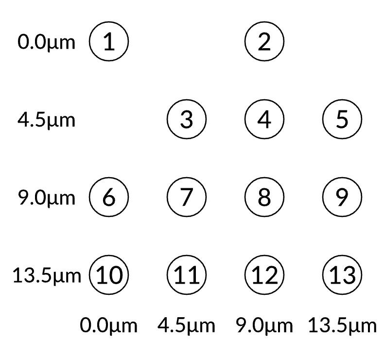
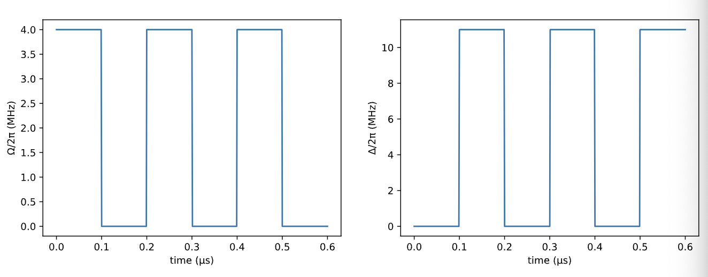
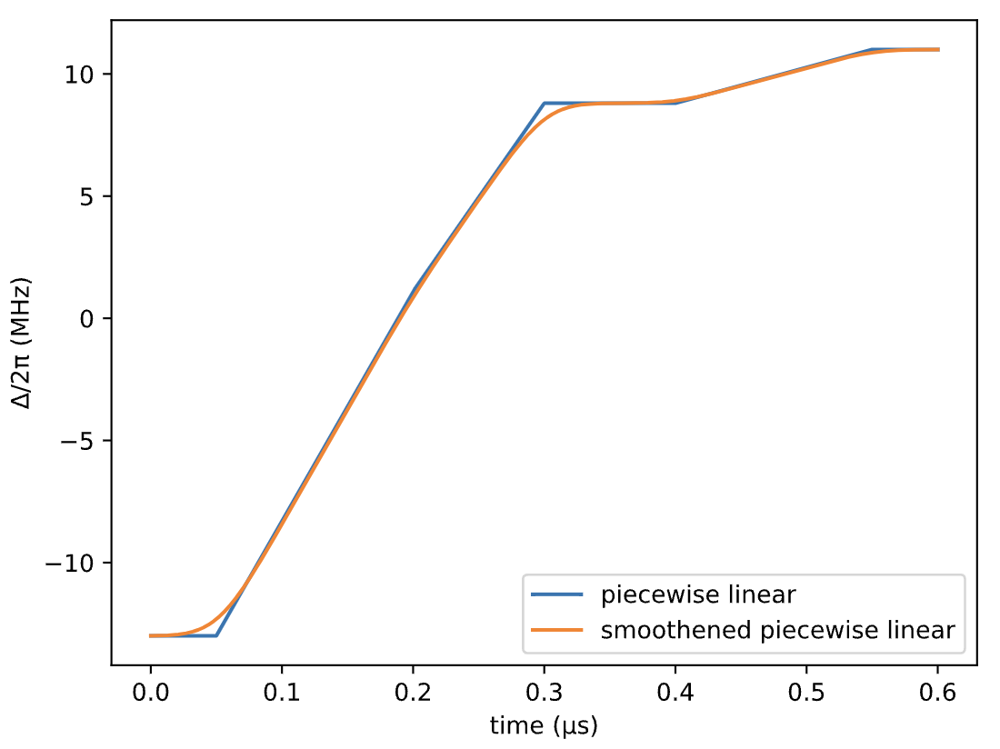
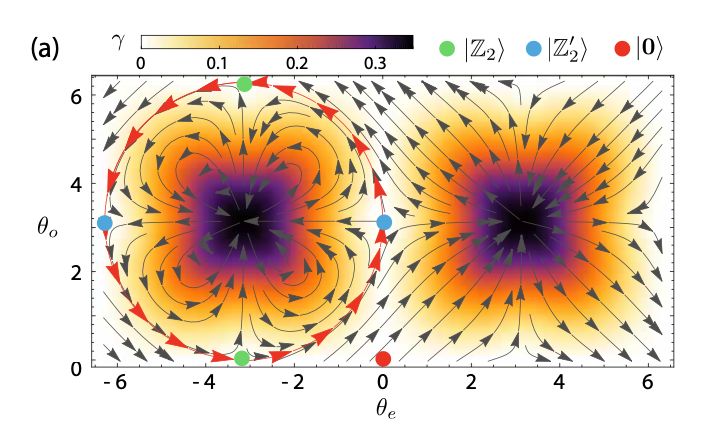

# Report
## I. Rydberg Blockade
1. The dynamics of the rydberg interacion.
When an atom is in the Rydberg state (expressed in $|r\rangle$), no other atoms within its **Rydberg radius** (which is expressed in $R_b$, and sets the characteristic distance scale for which Rydberg interaction will be strong compared to the coupling strength between the ground and the Rydberg state set by $\Omega$) can be excited to the Rydberg state. This phenomenon is called Rydberg blockade.
2. To approximate the blockade batter, the atoms should be closer than $R_b$, and the distance is refered to as **the subspace radius** $R_s(R_s \leq R_b)$.
3. Instead of simulating the quantum dynamics in the full $2^N$ Hilbert space, we choose the independent sets of the unit disk graph defined by the positions of the atoms.A unit disk graph is a set of vertices and edges, where each vertex represents an atom, and there are edges if the distance between vertices is less than or equal to some unit disk radius $|x_j - x_k|\leq R_u$, where the $x_j$ and $x_k$ correspond to the atoms and the $R_u$ is **the unit disk radius**.An independent set is a set of vertices in the graph such that no two of which are connected by an edge. Thus, the non-blockade-violated states are the independent set states of the corresponding unit disk graph, where the independent set consists of the vertices (atoms) that are excited to the Rydberg state. If we set $R_u = R_s$, it will be a good approximation to throw away those non-independent sets. 
4. We donete **the lower and upper bounds** of $R_u$ as $R_{min}$ and $R_{max}$, where $R_{min}$ can be without removing any edges from the unit disk graph, and $R_{max}$ can be without adding any additional edges to the unit disk graph.
5. To actual scale for $R_{min}$, $R_u$, and $R_{max}$ can be set by $R_b$.
In order to fulfill the condition
$$\frac{C_6}{R^6_{max}}\ll \Omega \equiv \frac{C_6}{R^6} \ll \frac{C_6}{R^6_{min}}$$
as much as possible, it's best to have $R_b = \sqrt{R_{min}R_{max}}$.
6. So, in theory, given an $\Omega$, we can find $R_b=(C_6/\Omega)^{(1/6)}$, and further find the distance $a$ between atoms according to the structure of the atoms arrangement. See [the web page](https://queracomputing.github.io/Bloqade.jl/dev/tutorials/1.blockade/main/) for a detailed example and other recommended **lattice constants** ($a$).
> **Notice:**
> **(a)** We truncate the Hilbert space to the low-energy subspace, because higher and higher energy causes more and more independet set violations.
> **(b)** In order to preserve dynamics within the subspace, the energy difference between states within the blockade subspace (e.g. ∣1r⟩) and outside (∣rr⟩) must be much larger than the Rabi strength. Formally, if $\Omega\ll C_6/R^6_s$, then the blockade approximation should be valid (the perturbation is typically in the second order ($\Omega/(C_6/R^6_s)^2$)). As long as this condition holds, the exact dynamics in the full Hilbert space should be closely approximated by the dynamics in the blockade subspace, as the mixing terms only couple to low-energy states.

(The above content is supported by [the web page](https://queracomputing.github.io/Bloqade.jl/dev/tutorials/1.blockade/main/). The Bloqade package is used to simulate rydberg interaction and it also proves that the evolution of the system in the subspace is basically consistent with the evolution in the full space.)

## II. The Maximum Independent Set Problem (MIS)
As mentioned in the previous chapter, we construct the blockade subspace by finding independent sets according to the unit disk graph. In this chapter, we'll look at how to solve the maximum independent set problem using the rydberg model.

1. **Background**: In graph theory, **an independent set** is a set of vertices in a graph such that no two of which are connected by an edge. There is a natural connection between the independent set constraint, and the Rydberg Blockade phenomenon.The Rydberg blockade implies that two atoms cannot be both excited to the Rydberg state ∣r⟩ if they are close to each other, whereas the independent set constraint means two vertices cannot be both in the independent set when they are connected by an edge. 
2. **Setting up**: An example will be used to illustrate the specific solution process.First, we create a 4×4 DUGG with 0.8 filling, by using the `random_dropout` function from the package `Bloqade`. And choose the lattice constant $a=4.5\mu m$:
   {width=50%}

   Next, we set $R_b=7.5\mu m$ and plot the interactions.
   {width=50%}
   
   To find a maximum independent set, we use classical algorithms to calculate the MIS size and its degeneracy as `(4.0, 26.0)ₜ`, which will be compared to the results of two other quantum algorithms.
3. **Quantum Alogrithm**
   The quantum algorithms we will used named **QAOA (Quantum Approximate Optimization Algorithm)** and **VQAA (Variational Quantum Adiabatic Algorithm)** are both hybrid quantum-classical algorithm. For MIS problem, the corresponding quantum part is a neutral-atom quantum computer first evolving under the Rydberg Hamiltonian with parameterized pulse sequences and then being measured in the computational basis. And the classical part of the algorithm is an optimizer. And we use the `expect` replaced by measuring in the computational basis and obtaining the averaged number of Rydberg excitations as the loss function (also called objective function or cost function.)

   **QAOA (Quantum Approximate Optimization Algorithm)**:
   In QAOA, we first construct the pulse sequences for the Rabi frequency Ω and the detuning Δ as:
   
   And the piecewise_constant pulses can be more accurately simulated with the KrylovEvolution solver.
   ```
   x0 = durations
   rydberg_density, reg1 = loss_piecewise_constant(atoms, x0)
   ```
   > `durations`: It is related to the time of Pulse application.
   > `loss_piecewise_constant(atoms, x0)`: `atoms`is atoms that we've arranged; `loss_piecewise_constant(atoms, x0)` outputs loss function and the result of system evolution which are assigned to `rydberg_density` and `reg1` respectively.

   The result of the loss function is shown as `-2.5628869128026794`, which does not look good. 
   
   We can throw it into an optimizer like the non-gradient-based optimizer `NelderMead` in the `Optim` package to optimize the parameter `x` whose value equals to `x0` above, to adjusting pulse. Finally the loss function has changed to `-3.0965910260012097`.
   
   **VQAA (Variational Quantum Adiabatic Algorithm)**
   In VQAA, we construct the adiabatic pulse sequences for the Rabi frequency Ω and the detuning Δ like:
   {width=75%}
   
   To get a more precise result, we take a `kernel_radius` keyword parameters to use the function `smooth`. The application of this function will affect the variation of $\Omega$ and $\Delta$, as follows:
   {width=45%} {width=45%}
   
   In this case, we check the loss function as `-3.890385062164213`. And if we use the `NelderMead` optimizer, the loss function will be changed to be `-3.974827326383817`.
   (The figure of $\Delta$ after optimizing is add below:)
   {width=45%}

This chapter is supported by [the web page (https://queracomputing.github.io/Bloqade.jl/dev/tutorials/5.MIS/main/)](https://queracomputing.github.io/Bloqade.jl/dev/tutorials/5.MIS/main/) and [S. Ebadi et al. (10.48550/arXiv.2202.09372)](https://arxiv.org/abs/2202.09372). In [the web page](https://queracomputing.github.io/Bloqade.jl/dev/tutorials/5.MIS/main/), the complete code examples and the application in VLSI Chip Manufacturing is given. [S. Ebadi et al. (10.48550/arXiv.2202.09372)](https://arxiv.org/abs/2202.09372) discussed in detail the effect of depth $p$ (which corresponds to the number of pulses in QAOA, and the duration of the sweep in VQAA), the hardness parameter($\mathcal{HP}=D_{|MIS|-1}/(|MIS|D_{|MIS|})$) and the number of MIS solutions (MIS degeneracy $D_{|MIS|}$) on the approximation error $1-R$ ($R \equiv \langle \sum_i n_i\rangle/|MIS|$) and other metrics.

## III. Quantum Scar
In the previous chapter we introduced the application of Rydberg atoms to MIS problem, and in this chapter we present the simulation of quantum many-body scars in Rydberg systems. The quantum many-body scars are the phenomenon that the Rydberg blockade constraint results into persistent revivals of quantum dynamics when the system starts with a particular initial state (e.g. the Neel state).
### 1. Rabi Oscillation
We choose a atom which starts from the ground state, and apply a resonant Rabi drive on it. The Rydberg density of this atom exhibits Rabi oscillations as a function of time.
{width=50%}
For the case of 2 and 3 atoms, if they both start from the ground state and are separated far enough with negligible interactions, the total Rydberg excitation densities are simply the sum of the Rydberg density for each atom. Then we apply a resonant Rabi drive on each atom.
Because of the Rydberg blockade, the system will undergo many-body Rabi oscillation with the state oscillating between the all 0 state ($|0\cdots 0\rangle$) and the W state($(1/\sqrt{N})\sum_i|g_i\cdots r_i\cdots g_N\rangle $), where the Rabi frequency will be enhanced. (For more information, please refer to [.Bernien, et al. (10.1038/nature24622)](https://www.nature.com/articles/nature24622))
### 2. Quantum Scar with a 1D-Chain
We first create a 9-atom system with a 1D-chain arrangement, where each atom is separated from its neighbors by $5.72 \mu m$. And we choose the waveforms made up of two parts as the following figures show. The first part is used to prepare an ordered Neel state, and the second part has constant values for the parameters. In this case, the nearest-neighbor Rydberg atoms are within the blockade radius and cannot be both excted simultaneously.

The Rydberg atom array initially prepared in the ground state. Then the time evolution of the quantum state can be simulated by an ODE solver([the `SchrodingerProblem` function](https://queracomputing.github.io/Bloqade.jl/dev/emulation/#Run-ODE-based-Emulation)). And finally measure the real-time expectation value of the Rydberg density and entanglement entropy. Here is the plot shows the Rydberg density for each site as a function of time.

There are clear oscillations between the two patterns of the Rydberg density after the first part of the pulse, which is a signature of the quantum scar.

If we choose a different initial state like $|100000101\rangle$, 
(See the web page [(https://queracomputing.github.io/Bloqade.jl/dev/tutorials/3.quantum-scar/main/)](https://queracomputing.github.io/Bloqade.jl/dev/tutorials/3.quantum-scar/main/) for details and codes for Section 3.1-2.)

### 3. Quantum Many-body Scars in constrained models: MPS
Here is a berief introduction about the [arthecle](https://journals.aps.org/prl/abstract/10.1103/PhysRevLett.122.040603).

In this article, authors anlyze the quantum dynamics of a family of constrained spin models, which display similar phenomenology of long-lived periodic revivals from certian special initial states. Specifically, they introduce a manifold of simple, locally entangled states respecting the constraints, representable by a class of low bond dimension matrix product states (MPS), and derive equations of motions (EOM) for them using the time-dependent variational principle (TDVP).

They mainly discussed the situation of a chain of L spin-s particles on a ring, with Hamiltonian:
$$H=\Omega\sum_i \mathcal{P}S^x_i\mathcal{P}.$$

The following diagram illustrates the dynamicsof local observalbe $S^z_i(t)$ over time when $H$ acts on $|0\rangle$ and $|\mathbf{Z_2}\rangle$ and $s=1/2$.
{width=75%}
The entanglement entropy is also shown, where the subregions $A$ are six contiguous sites and a single-site in (b) and (c), respectively.
{width=75%}

In **TDVP**, we start from classical spin configurations, i.e. products of unentangled coherent states $\bigotimes_i|\psi(\upsilon_i, \varphi_i) \rangle:=\bigotimes_i[cos(\upsilon_i/2)|0\rangle_i - i e^{i \varphi_i} sin(\upsilon_i/2)|1\rangle_i]$. We construct states that respect the constraints set by $\mathcal{P}$, by explicitly projecting out neighboring excitations, 
$$|\psi(\upsilon,\varphi)\rangle = \mathcal{P}\bigotimes_i|\psi(\upsilon_i, \varphi_i).$$
$|\psi(\upsilon,\varphi)\rangle$ is weakly entangled and can be written as a particular matrix product state(MPS) with bond dimension $D=2$. And it is convenient to be normalized and changed to new variables $(\upsilon, \varphi)\rightarrow(\theta,\phi)$, such that $|\psi(\upsilon,\varphi)\rangle/||\psi(\upsilon, \varphi)||=|\psi(\theta,\phi)\rangle$, so that the MPS representation is given by
$$|\psi(\theta,\phi)\rangle=Tr(A_1A_2\cdots A_L),$$
$$A_i(\theta_i,\phi_i)=
\begin{pmatrix}
    P_i|(\theta_i, \phi_i)\rangle & Q_i|(\theta_i, \phi_i)\rangle \\
    |0\rangle _i & 0
\end{pmatrix}
$$
and $|(\theta_i, \phi_i)\rangle = e^{i\phi_is}e^{i\phi_iS^z_i}e^{-i\theta_iS^x_i}e^{-i\theta_iS^x_i}|0\rangle_i$.

We can set $\phi=0$ due to the conservation of the Hamiltonian enery, which is obeyed for initial product states in the $\mathcal{z}$-basis. The TDVP-EOM are obtained by projecting the instantaneous motion of the quantum system onto the tangent space of the variational manifold, and can be expressed by $\dot{\theta}_e (t) = f (\theta_e (t), \theta_o (t))$ and $\dot{\theta}_o(t)=f(\theta_o(t),\theta_e(t))$, with
$$f (x, y) = \Omega [1 − cos^{4s-2}(\frac{x}{2})+\cos^{4s−2}(\frac{x}{2})\cos^{2s}(\frac{y}{2})+2s\sin(\frac{x}{2})\cos^{6s-1}(\frac{x}{2})\tan(\frac{y}{2})].$$

{width=75%}
We show the flow diagrams of $\dot{\theta}_e(t)$ and $\dot{\theta}_o(t)$. And The color map gives the error $\gamma(\theta)=||(iH+\dot{\theta}\partial_\theta)|\psi(\theta)\rangle||\sqrt{L}$, which is the instantaneous rate at which the state evolving under the full Hamiltonian leaves the variational manifold, while it is used to quantify the error. 
The numerically integrated error rates around the closed orbits $\epsilon_\mathcal{C}=\oint_\mathcal{C}\gamma(\theta_e(t),\theta_o(t))dt$ yield $\epsilon_\mathcal{c}\approx 0.17, 0.32, 0.41$ for $s=1/2,1,2$ respectively, which are small values compared to neighboring trajectories, illustrating that $\mathcal{C}$ is indeed a good approximation to exact quantum dynamics.

We have made a brief introduction to the relevant methods and variable solution of quantum many-body scars simulation. The calculations and other details can be found in the [original paper](https://journals.aps.org/prl/abstract/10.1103/PhysRevLett.122.040603).
## Apendix
### TDVP
