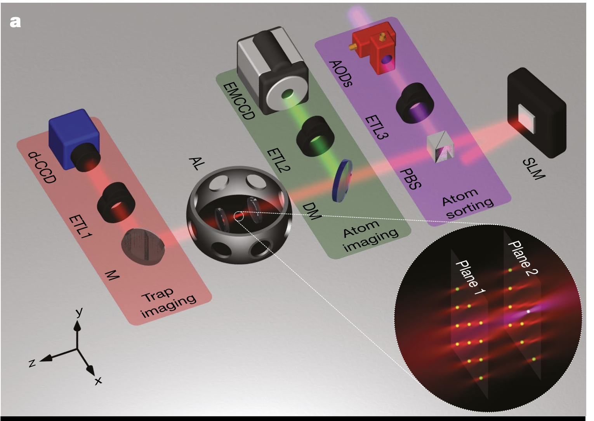
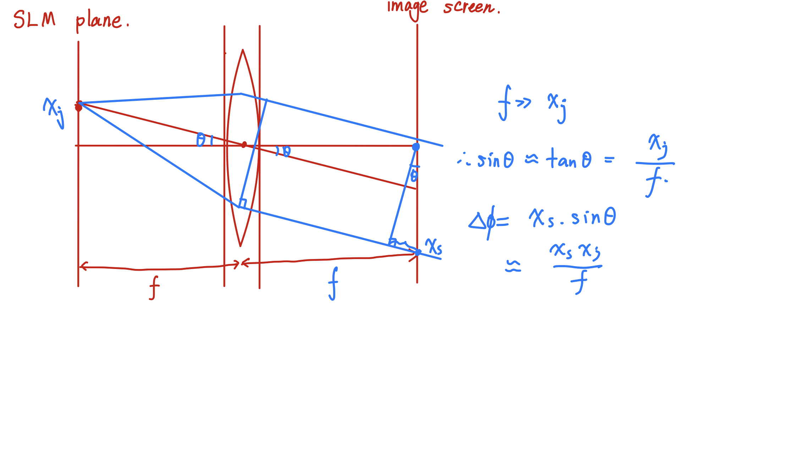

# Generating 3D array with SLM

2024/03/17
Han Wang

1. An example of 3D arrays using programmable holographic optical tweezer.[^Barredo2018]
   - Main method: They imprint a phase pattern (calculated using 3D Gerchberg-Saxton algorithm) on a dipole trap beam at 850 nm with SLM.
   - The experimental setup is shown below: 
    
   - Main parts for a experimental system: 1.  Arbitrary 3D array generation with SLM. 2. Trap imaging system（The second AL together with ad-CCD camera and ETL1 can help measure the intensity distribution in the focal plane）3. Atom imaging system（The fluorescence of the atoms in the traps is at 780nm which is deflected by DM and imaged by EMCCD. 4. Atom sorting system: An extra laser going through AODs can realize moving tweezers through PBS.  
   - plane by plane assembly: The minimal separation between layers to avoid influence is 14$\mu$m.
   - The sequence for creating fully loaded patterns: The main sequence is shown below. In ech plane, it is required that the number of generated traps should be twice as number of traps that we need to load.  1. Loading the MOT and taking fluorscence pictures of each plane. 2. When enough atoms are loaded on each plane, the assembler starts to work. 
2. Objectives
   - create a double layer optical array with SLM.
3. Methodology
   - We mainly use SLM to generate the required holograms.
   - The holograms are calculated using the 3D Gerchberg-Saxton algorithm.
4. Gerchberg-Saxton algorithm[^Keesling]
   - To determine phase-only computer generated holograms(CGHs), iterative Fourier-transform algorithms (IFTAs), originally devised by Gerchberg and Saxton, are widely used. GS algorithm is a interative phase finding algorithm that can be used to find complex phases when one only have access to the amplitudes of an image and the amplitude of its Fourier transform.
   - how to generate an optical focus array with a phase spatial light modulator:
   - -  The large-scale optical focus array are locate at focal plane(n-plane) of a focusing lens and the SLM is placed on the lens' back focal plane(x-plane). A spatially coherence light beam is reflected by the SLM. The reflected wave front is shaped by a CGH $\Phi(x)$ displayed on SLM. This phase information can be derived through GS algorithm. 
   - - In GS algorithm, the initial phase information is a random phase map which is uniformly distribute from $-\pi$ to $\pi$. Assuming that the amplitude and phase in focal plane is $B_i(u)$ and $\Psi(u)$; the amplitude and phase in SLM plane is $\sqrt(I(x))$ and $\phi_i(x)$. 
   - - Design a focus pattern that you need. For example, I designed a pattern shown below:
   - - Performing an inverse Fourier transform to the target intensity distribution, we can get the phase distribution and intensity in the SLM plane.. But the phase information is not clear.
   - - Now we start to use GS algorithm.
   - - generating a random initial phase "randphase" $\phi$.$A=e^{i*rand(phi)}$.
   - - $B=abs(src)\dot e^{iarg(A)}$ to derive the nearfield information at the first cycle.
   - - Performing FFT on B : $C=fft(B)$. extract and save the phase information.
   - - $D = abs(trg)\dot e^{iarg(C)}$  keep multiply the target amplitude and input the stored phase information.
   - - Perform iFFT on D and it is the nearfield information. Compare it with previous A.keep doing this until the phase information is stable.
   - - After the GS algorithm, the calculated detailed phase map is shown below:
   - Conclusion: The information of focal plane can be derived by the 2D Fourier transform from SLM plane. In this process, we define a random phase profile for nearfield and we convert it to farfield image through FFT transformation. Then we save the phase information and apply the target intensity to the farfield image and apply an IFFT transformation to it. After many rounds, we can derive a detailed phase profile for the target distribution.
   - This Gerchberg-Saxon algorithm code "example2D_UPDATE.py" is an interative phase-finding algorithm that can be used to find complex phases when we only have access to the amplitudes of an image and the amplitude of its Fourier transform.

5. traditional 3D Gerchberg-Saxton algorithm[^Pengcheng] 
   - The intention is to obtain arbitrary three dimensional traps arrangements with a high efficiency.
   - The traditional 3D GS algorithm:
   - - Traditinal 3D GS algorithm is used to reproduce multiple planes. Because 3D object can be divided into multiple planes and the iteration loop is constructed between object planes and the kinoform plane.
   - - In the algorithm, they use the Fresnel transformation to convert the complex-valued function from one plane to another. The Fresnel integral is used to calculate the complex amplitude distribution of a wavefront after it has passed through a given optical system.
   - - In this way, for the nth plane, the process can be described in :
 $U_n=FrT(U_H)=F_n\times exp(i\phi_n)$
 After amplitude replacement, 
 $U_n^R=T_n\times exp(i\phi_n)$
 where T is the target amplitude for the nth plane.
 $U_H=FrT(U_n)=F_H\times exp(i\phi_H)$
 Also, after amplitude transformation:
 $U_H^R=T_H\times exp(i\phi_H)$
   - - Blocks for traditinal 3D GS algorithm: In the reproduction, image-qualities in different object planes vary and there is large image-quality difference along the direction of light propagation. Therefore, some planes are clear but some planes are more blurred or even not recognizable. 
   - - The main reason: When enforcing amplitude replacement at one object plane, information of previous planes is lost to some degree. The degree of decay depends on the positions of object planes in the iteration loop.
   - - For example, as shown in Figure below, the iteration loop: kinoform→ plane 1→ plane 2→...→ plane n →kinoform. 
   - - Plane 1 is the farthest from the final kinoform, so the degree of decay of plane 1 is the highest, and as a result, the image-quality in plane 1 is the worst. 
   - - The image-quality difference among those object planes severely degrades the visual effect of the 3D holographic display.

6. 3D Gerchberg-Saxton Algorithm[^Di] [^Pozzi] [^Jonathan]
   - Assuming a uniform illumination on the SLM. Using scalar diffraction theory to propagate the electric field complex amplitude from the jth pixel surface to the location of the mth trap in image space. Summing up the contributions from all the N pixels we obtain the complex amplitude $v_m$ of electric field on trap m:
   - The relationship between the complex amplitude of SLM and the complex amplitude on the trap m can be explained as follows:
   - First, we can talk about Fourier imaging system where the phase change is easy to derive in 1D situation:
   - For the imaging system mentioned in paper, there is an uniform illumation on SLM. The sum of all contributions from each pixel of SLM will result in a complex amplitude on correspinding trap. 
   - The complex amplitude of SLM:$u_j=|u|exp(i\Phi_j)$
   - Because of the diffraction process:
   - The whole process can be summerized below:
   - The complex amplitude on the trap m is:
   - $v_m=\frac{d^2exp(i2\pi(2f+z_m)/\lambda)}{i\lambda f}\sum_{j=1,N}|u|exp(i(\phi_j-\Delta_j^m))$ 
   - and
   - $\Delta_j^m=\frac{z_m\pi}{\lambda f^2}(x_j^2+y_j^2)+\frac{2\pi}{\lambda f}(x_jx_m+y_jy_m)$
   - Summing up the contributions from all the N pixels on SLM, we obtain the complex amplitude on trap m.
   - The phase map on SLM can be described with:$\Phi_{cgh}(x_j,y_j)=arg\sum_{N=1}^N\frac{1}{N}exp(-i\Delta^m_j+\theta_n)$
   - where $\theta_n$ is the constant phase terms. If we simply solve the equation shown above, we can derive the phase map on SLM with low quality which is called RS algorithm.
   - 1. RS algorithm directly generation:
   - - The phase map can be directly generated through the Fourier Optics：Assuming that there exists a SLM plane with coordinates($x_j,y_j$) and it generates N 3D spots in the image space with coordinates $(x_m, y_m, z_m)$. Assuming that the phase map in SLM plane is $\Phi_{cgh}(x_j,y_j)$ and the phase map generating a single spot at coordinates $(x_m, y_m, z_m)$ in the image space is $\Delta^m_j$.Thus, the whole phase map on SLM can be described with $\Phi_{cgh}$.
   - To compute optimal values of $θ_n$, the GS algorithm proceeds by alternating projections. 
   - 2. Weighed GS algorithm generation:
   - - In the weighted Gerchberg-Saxton algorithm, the initial values of the phases $\theta_n^0$ are chosen at random and it will be determined through a series of alternating projections between the SLM space and the spots’ positions. The algorithm begins by computation of the RS hologram $\Phi_{cgh}$.
   - - The inital phase map can be calculated through the equation shown above.
   - - At the k-th iteration, the field $E_n^k$ of each spot is calculated as:$E_n^k=\sum_{x',y'}Aexp(-i(\Phi_{cgh}-\Delta_m^j))$ where $||A(x_j,y_j)||^2$ is the distribution of light intensity in SLM plane. At this point, $\theta_n$ and $a_0$. $w_n^k=w_n^{k-1}\frac{\langle||E_n^{k-1}||\rangle^N_{n-1}}{||E_n^{k-1}||}$ $a_n^k=w_n^ka_0$ $\theta_n=arg(E_n^{k-1})$. where $w_n^j$ is the weight factors of the n-th spot at the k-th iteration. The weights are updated at each iteration to ensure that the intensity of each spot is equal to the average intensity of all the spots.
7. References
[^Barredo2018]: Barredo, D., Lienhard, V., de Léséleuc, S. et al. ["Synthetic three-dimensional atomic structures assembled atom by atom."](https://doi.org/10.1038/s41586-018-0450-2
) Nature 561 (2018): 79–82.

[^Keesling]: Keesling, A., Omran, A. et al., [“Large-Scale Uniform Optical Focus Array Generation with a Phase Spatial Light Modulator.”](https://doi.org/10.1364/OL.44.003178)Optics Letters, 44(12), 3178. 

[^Di]: Di Leonardo, R., Ianni, F. & Ruocco. et al. ["Computer generation of optimal holograms for optical trap arrays."](https://doi.org/10.1364/OE.15.001913) Optics Express, 15(4), 1913.

[^Pengcheng]: Pengcheng, Z., Yan, L. et al. ["Multi‐Plane Holographic Display with a Uniform 3D Gerchberg‐Saxton Algorithm."](https://doi.org/10.1002/sdtp.10411) SID Symposium Digest of Technical Papers, 46, 2015.

[^Jonathan]: Pozzi, Paolo, and Jonathan Mapelli.["Real Time Generation of Three Dimensional Patterns for Multiphoton Stimulation."](https://doi.org/10.3389/fncel.2021.609505.) Frontiers in Cellular Neuroscience, 15(609505), 2021.

[^Pozzi]: Pozzi, Paolo, Laura Maddalena et al. [“Fast Calculation of Computer Generated Holograms for 3D Photostimulation through Compressive-Sensing Gerchberg–Saxton Algorithm.”](https://doi.org/10.3390/mps2010002.) Methods and Protocols 2, no. 1 (December 20, 2018): 2. 
[End of Report]