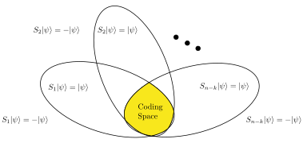
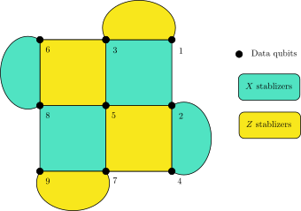
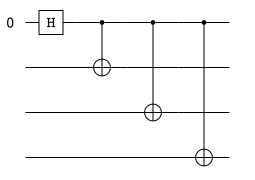
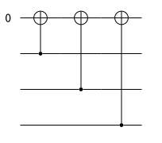
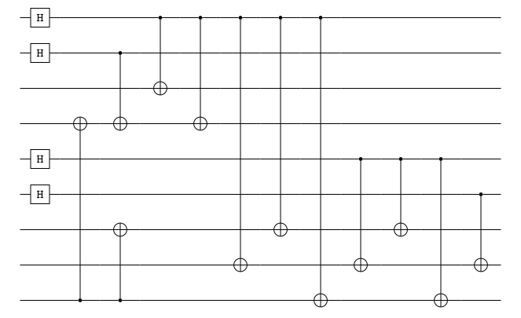

# Quantum Error Correction

- Zhongyi Ni: [zni573@connect.hkust-gz.edu.cn](mailto:zni573@connect.hkust-gz.edu.cn)

## Ref for Begginers
Some comprehensive introduction to quantum error correction:
1. The Bible!(Quantum computation and quantum information)[^nilson] Easy to read, some topic may not be too detailed. It's a good starting point!
2. A Tutorial on Quantum Error Correction.[^Steane2006](No comments yet, since I haven't read it. If I don't understand other articles, I refer to this one for comparison)
3. Daniel Gottesman's thesis[^Gottesman]. 100 pages, original and comprehensive. Some topics may be outdated.
  
## Big Picture of Quantum Error Correction
Quantum error correction is a process of protecting quantum information from errors. The errors can be caused by the environment, the control system, or the quantum gates. The quantum error correction is a process of encoding the quantum information into a larger Hilbert space such that the quantum information can be recovered from the errors. Usually, a quantum error correction scheme is described by a stabilizer group.
## Stablizers and Quantum Codes
In this section, we will introduce the concept of stabilizers and quantum codes. 
**Definition (Pauli Group and Stabilizer Group)** - *The stabilizer group $\mathcal{S}$ is an Abelian subgroup of the $n$-qubit Pauli group. The $n$-qubit pauli group is the group generated by the $n$-qubit Pauli matrices*
$$
\mathcal{P}_n = (\plusmn i)\{I, X, Y, Z\}^{\otimes n}
$$
*We usually call the elements of the Pauli group pauli operators or pauli strings.*

The stabilizer group is abelian means that it is commutative and the measurement outcome of any two stabilizers will not affect each other. We can specify a stabilizer group by giving a set of independent stabilizer generators $\{S_a\}_{a=1,...,m}$
$$
\mathcal{S} = \langle S_1, S_2,...,S_m\rangle.
$$
The code space is the +1 eigenspace of all the stabilizers. We can detect whether a state is in the code space by only measuring the generators of the stabilizer group. If any of the generators gives -1, then the state is not in the code space. And we call such an outcome a symdrome. It is worth mentioned that this measurement will not cause the quantum computing collapse, since we only measure the stabilizers and the final state is in a subspace of the original Hilbert space, which is the code space or an error space. The entanglements in the code space are not destroyed. 

**Definition (Quantum Code)** - *An $[[n,k,d]]$ quantum code is a quantum error correction scheme that encodes a $k$-qubit subspace of an $n$-qubit Hilbert space with minimum distance $d$. The minimum distance is the minimum pauli operators that need to be apllied on one code word to get to another code word.*

Usually, we can specify an $[[n,k,d]]$ quantum code by giving a set of $n-k$ independent stabilizer generators.
**Definition (CSS Code)** - *We call a quantum stabilizer code a Calderbank-Shor-Steane (CSS) code if the stabilizer group can be generated by pauli matrices that only contain $X$ or $Z$ operators, i.e.,*
$$
\mathcal{S} = \langle S_a \rangle_{a=1,...,n-k}, \text{ where }S_a \in \{I, X\}^{\otimes n}\cup \{I, Z\}^{\otimes n}.
$$

### Examples
1. We denote the stabilizer group of a 3-qubit code as
   $$
   \mathcal{S} = \{Z_1Z_2,Z_2Z_3,Z_1Z_3 \}= \langle Z_1Z_2, Z_1Z_3 \rangle.
   $$
   The code space is $|000\rangle$ and $|111 \rangle$. This code is a classical code, since it can't correct any Z error on a single qubit.
2. Toric code[^Kitaev].
3. Surface code[^Kitaev] is similar to the toric code with a different boundary condition. The stabilizer group of a $[[9,1,3]]$ surface code is shown in [fig](#fig2).

   
4. $[[8,3,2]]$ code[^Menendez][^colorcode].
5. Color code[^Kubica].
   
## Logical Operator and Minimum Distance
The logical operators are the operators that will not take the state out of the code space. Therefore we have the following definition.
**Definition (Logical Operator)** - *A logical operator is a unitary operator that maps the code space to itself, i.e., the code space is an invariant subspace of the logical operator.*

The centralizer group of $\mathcal{S}$ is a proper set of the logical operators, which is the set of all operators that commute with all the elements of $\mathcal{S}$. 
$$
C(\mathcal{S}) = \{U\in SU(2^n)|US = SU, \forall S\in \mathcal{S}\}.
$$
For any operator $U$ in the centralizer group, since $SU|\psi\rangle = US|\psi\rangle =U|\psi\rangle$, the state $U|\psi\rangle$ is also in the code space. We may notice that the pauli strings are either commute or anti-commute to each other. Therefore, a pauli string is a logical operator if and only if it is in the centralizer group. 
Any unitary operator that is not a logical operator will take some states out of the code space. If this operator is applied on the state by the environment,
there are errors in the stabilizer code. And people mainly focus on the pauli errors, which are the errors that are caused by the pauli strings. With the above definition, we have the following statement.

**Statement** - *Any pauli error of length less than $[\frac{d-1}{2}]$ happened in a $[[n,k,d]]$ quantum code can be corrected. *

By the definition of $[[n,k,d]]$ code, $d$ is exactly the minimum length of pauli strings that are in the centralizer group but not in the stabilizer group. That is, the minimum length of pauli strings that can be used to switch between different code words in code space.

If we know what error it is exactly, we can correct it by applying the inverse of it to the qubits. And we only have the information of the measurement outcome. If we want to correct all pauli errors of length less than $[\frac{d-1}{2}]$, there must be a bijection from pauli errors of length less than $[\frac{d-1}{2}]$ to the sydromes. If there are two different pauli errors that give the same syndrome, then we don't know which error has happened and we don't know how to correct it. If the length of these two errors $k_1,k_2$ is less than $[\frac{d-1}{2}]$, we can construct a pauli string of length at most $k_1+k_2$ that commutes with all the stabilizers. If this pauli string is in the stabilizer group, then the two errors are equivalent and we can correct it by applying any one of them to the physical qubits. If this pauli string is not in the stabilizer group, then we get a contradiction that the minimum distance is $k_1+k_2<d$. Therefore, we can always correct an error of length less than $[\frac{d-1}{2}]$. 

□

## Clifford Group and Encoding Circuit
> **Definition (Encoding circuit)** - For a $k$-qubit state $|\psi\rangle$ with $(n-k)$ ancilla qubits $|0\rangle^{n-k}$, an encoding circuit is a unitary operator $U$ such that the state $U|\psi\rangle|0\rangle^{n-k}$ is in the code space of a quantum code $\mathcal{S}$.

Applying any unitary operator $U$ on a state $|\psi\rangle$ stabilized by a stabilizer $S_i$, we have 
$$
(US_i U^\dagger) U|\psi\rangle = U S_i |\psi\rangle = U|\psi\rangle.
$$
Therefore the state $U|\psi\rangle$ is stabilized by $US_i U^\dagger$. The stabilizer group of the $n$-qubit state $|\psi\rangle|0\rangle^{n-k}$ is
$$
\{Z_{k+1}, Z_{k+2},...,Z_n\}.
$$
Clearly, the quantum data is easily corrupted by any single qubit error on the first $k$ qubits. We want to find an encoding circuit $U$ such that the stablizers after encoding are the stablizers we want.
$$
\{Z_{k+1}, Z_{k+2},...,Z_n\} \rightarrow \{UZ_{k+1}U^\dagger, UZ_{k+2}U^\dagger,...,UZ_nU^\dagger\}.
$$
For example, the 3-qubit bit-flip code is encoded by two CNOT gates. 
$$
(a|0\rangle+b|1\rangle)|0\rangle|0\rangle \xrightarrow{\operatorname{CNOT}_{1,2}\operatorname{CNOT}_{2,3}} a|000\rangle+b|111\rangle.
$$
We hope that the stabilizers after encoding are still pauli operators. This leads to the definition of the Clifford group. 
> **Definition (Clifford Group)** - The Clifford group is the normalizer of the Pauli group in $SU(2^n)$. In other words, if $U$ is a Clifford operator, we have
$$
U P U^\dagger \in \mathcal{P}_n, \quad \forall P\in \mathcal{P}_n.
$$

The Clifford group can be generated by the Hadamard gate $H$, the phase gate $S$, and the CNOT gate. It is worth mentioned that the Clifford group is not universal for quantum computing unless we add $T$ gate.

For a specific quantum code, how to find its encoding circuit is a non-trivial problem. We detialed the approach to find the encoding circuit for CSS code in the section [Encoding a CSS Stabiliser Code](#encoding-a-css-stabiliser-code-gottesmanhiggott).

## Sydrome Measurement and Error Correction
First, we need to measure the stabilizers to detect whether the state is in the code space. Here is a simple example of how to measure a $X_1X_2X_3$ stabilizer non fault tolerantly. The first qubit is the ancilla qubit.
$$
|0\rangle|\psi \rangle \xrightarrow{\operatorname{H}_{0}} \frac{1}{\sqrt{2}}(|0\rangle+|1\rangle)|\psi \rangle\xrightarrow{\operatorname{CX}_{1}\operatorname{CX}_{2}\operatorname{CX}_{3}}\frac{1}{\sqrt{2}}(|0\rangle|\psi \rangle \pm |1\rangle |\psi \rangle)\xrightarrow{\operatorname{H}_{0}}|0\rangle|\psi \rangle \text{ or } |1\rangle|\psi \rangle.
$$

If the state is not in the code space, we need to infer where and what the error is and then apply its inverse to correct the error. We have several methods to infer the error.
1. We can make a lookup table for every error shorter than $[\frac{d-1}{2}]$. With this table, we can correct any error of length less than $[\frac{d-1}{2}]$.
2. Bayes inference with tensor network. [^Ferris]
3. MLE and Belief-HUF[^Cain].

## Encoding a CSS Stabiliser Code [^Gottesman][^Higgott]
In this section, we will show how to encode a CSS stabilizer code $\mathcal{S}=\langle M_1,...,M_{n-k}\rangle$ from $|\psi\rangle|0\rangle^{n-k}$ state, where $M_i \in \{I, X\}^{\otimes n}\cup \{I, Z\}^{\otimes n}$. More specifically, we need to find a unitary operator $U$ such that the stabilizer group after encoding is as we want.
$$
\langle UZ_{k+1}U^\dagger, UZ_{k+2}U^\dagger,...,UZ_nU^\dagger\rangle=S.
$$
Directly, we can construct a stablized state by simultaneously applying every stabilizer in the stabilizer group to the state. 
$$
|\bar{0}\rangle \equiv \sum_{S\in \mathcal{S}}S|0\rangle^{n}
$$
We omit a prefactor of $1/\sqrt{|\mathcal{S}|}$ for simplicity. For any stabilizer $S_0 \in \mathcal{S}$, applying $S_0$ on $\mathcal{S}$ will only give us a permutation of $\mathcal{S}$. Therefore, we have
$$
S_0|\bar{0}\rangle = \sum_{S\in \mathcal{S}}S_0S|0\rangle^{n} = \sum_{S\in \mathcal{S}}S|0\rangle^{n} = |\bar{0}\rangle.
$$
$\mathcal{S}$ can be generated by $\{M_i\}$. Since $M_i$ is independent and commute to each other, we have
$$
\sum_{S\in \mathcal{S}}S=\prod_{i=1}^{n-k}(I+M_i).
$$
To apply the product of $I+M_i$ on $|\psi\rangle|0\rangle^{n-k}$, we need to perform an guassian elimination first. We define matrix $M$ such that the $i$-th row of $M$ is the binary representation of $M_i$. 
$$
M = \begin{pmatrix}
L & R
\end{pmatrix},
$$
where $L$ and $R$ are $(n-k)\times k$ matrices. $L_{i,j}=1$ if and only if the $i$th stabilizer $M_i$ has $X$ on the $j$th qubit. $R_{i,j}=1$ if and only if the $i$th stabilizer $M_i$ has $Z$ on the $j$th qubit. We will take the $[[9,1,3]]$ surface code as an example. The $M$ matrix is
$$
\left(\begin{array}{lllllllll|lllllllll}
0 & 1 & 0 & 1 & 0 & 0 & 0 & 0 & 0 & 0 & 0 & 0 & 0 & 0 & 0 & 0 & 0 & 0 \\
1 & 1 & 1 & 0 & 1 & 0 & 0 & 0 & 0 & 0 & 0 & 0 & 0 & 0 & 0 & 0 & 0 & 0 \\
0 & 0 & 0 & 0 & 1 & 0 & 1 & 1 & 1 & 0 & 0 & 0 & 0 & 0 & 0 & 0 & 0 & 0 \\
0 & 0 & 0 & 0 & 0 & 1 & 0 & 1 & 0 & 0 & 0 & 0 & 0 & 0 & 0 & 0 & 0 & 0 \\
0 & 0 & 0 & 0 & 0 & 0 & 0 & 0 & 0 & 1 & 0 & 1 & 0 & 0 & 0 & 0 & 0 & 0 \\
0 & 0 & 0 & 0 & 0 & 0 & 0 & 0 & 0 & 0 & 1 & 0 & 1 & 1 & 0 & 1 & 0 & 0 \\
0 & 0 & 0 & 0 & 0 & 0 & 0 & 0 & 0 & 0 & 0 & 1 & 0 & 1 & 1 & 0 & 1 & 0 \\
0 & 0 & 0 & 0 & 0 & 0 & 0 & 0 & 0 & 0 & 0 & 0 & 0 & 0 & 0 & 1 & 0 & 1 \\
\end{array}\right)
$$

The stabilizers of CSS code don't have $X$ and $Z$ at the same time. Therefore, the $L$ and $R$ matrices are always orthogonal to each other.
$$
L=\begin{pmatrix}
A\\
0\\
\end{pmatrix}, R=\begin{pmatrix}
0\\
B\\
\end{pmatrix},
M = \begin{pmatrix}
A & 0\\
0 & B\\
\end{pmatrix}.
$$
We can perform a "mod$2$" guassian elimination on $M$. "mod$2$" means 
$$
0+0=1+1=0, 1+0=0+1=1.
$$
During the guassian elimination, we can permutation the rows or columns of $M$, which means that we reorder the stabilizers or thequbits. We can also add a row to another row, which means we multiply a stabilizer by another stabilizer to get a replacement stabilizer. For example,
$$
\langle Z_1Z_2,Z_2Z_3\rangle \rightarrow \langle Z_1Z_2,(Z_1Z_2)(Z_2Z_3)\rangle=\langle Z_1Z_2,Z_1Z_3\rangle.
$$
After the guassian elimination, we can get a standard form of matrix $M$
$$
M = \left(\begin{array}{ccc|ccc}
I_x & A_1 & A_2 & 0 & 0 & 0 \\
0 & 0 & 0 & D & I_z & E
\end{array}\right),
$$
where $I_x$ and $I_z$ are identity matrices with dimension $r$ and $n-k-r$, respectively. $r$ is the number of stabilizers that only contain $X$ operators. $n-k-r$ is the number of stabilizers that only contain $Z$ operators. $E$ and $A_2$ are $n-k-r$ times $k$ matrices. The qubits corresponding to the rows of this two matrices are the data qubits, which are the qubits we want to encode. And the first $n-k$ qubits are ancilla qubits, which are in the state $|0\rangle^{n-k}$ at the beginning.

The standard form of $[[9,1,3]]$ surface code is 
$$
\left(\begin{array}{lllllllll|lllllllll}
1 & 0 & 0 & 0 & 0 & 1 & 0 & 0 & 0 & 0 & 0 & 0 & 0 & 0 & 0 & 0 & 0 & 0 \\
0 & 1 & 0 & 0 & 1 & 1 & 1 & 1 & 1 & 0 & 0 & 0 & 0 & 0 & 0 & 0 & 0 & 0 \\
0 & 0 & 1 & 0 & 0 & 0 & 1 & 1 & 1 & 0 & 0 & 0 & 0 & 0 & 0 & 0 & 0 & 0 \\
0 & 0 & 0 & 1 & 0 & 0 & 1 & 0 & 0 & 0 & 0 & 0 & 0 & 0 & 0 & 0 & 0 & 0 \\
0 & 0 & 0 & 0 & 0 & 0 & 0 & 0 & 0 & 0 & 1 & 0 & 0 & 1 & 0 & 0 & 0 & 0 \\
0 & 0 & 0 & 0 & 0 & 0 & 0 & 0 & 0 & 1 & 0 & 1 & 0 & 0 & 1 & 0 & 0 & 1 \\
0 & 0 & 0 & 0 & 0 & 0 & 0 & 0 & 0 & 0 & 1 & 1 & 1 & 0 & 0 & 1 & 0 & 0 \\
0 & 0 & 0 & 0 & 0 & 0 & 0 & 0 & 0 & 0 & 0 & 0 & 0 & 0 & 0 & 0 & 1 & 1 \\
\end{array}\right)
$$

where the qubit order is $2,1,5,6,3,4,8,7,9.$
Through simpily verify, we have 
$$
(I+X_1X_2X_3...X_k)|0\rangle_1|\phi\rangle_{2...k} = H_1 CNOT_{1,2}CNOT_{1,3}...CNOT_{1,k} |0\rangle_1|\phi\rangle_{2...k}.
$$
In other words, as long as the first qubit is $|0\rangle$, we can perform $I+X_1...X_k$ with a Hadamard gate and a series of CNOT gates. And that is the exact reason for the guassian elimination. Because when we perform the $I+M_1$ of the first $X$ stabilizer, it won't affect the second qubit, so we can take the second qubit as the $|0\rangle$ qubit to perform the $I+M_2$. So the encodign circuit for an $X$ stabilizer $X_1X_2X_3X_4$ is

For the $Z$ stabilizers, we can also check that $CNOT_{2,1}CNOT_{3,1}...CNOT_{k,1} |0\rangle_1|\phi\rangle_{2...k}$ is stabilized by $Z_1Z_2...Z_k$. And this circuit works trivally on $|0\rangle|\phi\rangle=|0\rangle^{k}$. So the encoding circuit for a $Z$ stabilizer $Z_1Z_2Z_3Z_4$ is

We can perform $Z$ stabilizers first since they are commutative to the $X$ stabilizers. And most of the CNOT gates act trivially on the qubits that are in the state $|0\rangle$.

The encoding circuit for $[[9,1,3]]$ surface code, where the last qubit is the data qubit.

## Transversality and Universality
Transversal gates are the gates that act on every qubit independently. It will not cause an error spreading. Thus they are netually fault tolerant.
- Gottesman-Knill Theorem[^nilson]: Clifford circuits can be classical simulated efficiently. 
- Eastin-Knill Theorem [^Eastin]: No quantum code can have a universal set of transversal gates.
- Fault-tolerant computation and Threshold theorem[^nilson]

[^Menendez]: Menendez, D. H.; Ray, A.; Vasmer, M. Implementing Fault-Tolerant Non-Clifford Gates Using the [[8,3,2]] Color Code. arXiv September 15, 2023. http://arxiv.org/abs/2309.08663.

[^colorcode]: [THE SMALLEST INTERESTING COLOUR CODE](https://earltcampbell.com/2016/09/26/the-smallest-interesting-colour-code/)

[^nilson]: M. A. Nielsen and I. L. Chuang, Quantum Computation and Quantum Information, Cambridge University Press, 2000. http://mjg.global.s3.amazonaws.com/static/projects/refs/Quantum_Computation_and_Quantum_Information.pdf

[^Steane2006]: A Tutorial on Quantum Error Correction ([PDF](./materials/Steane%20-%20A%20Tutorial%20on%20Quantum%20Error%20Correction.pdf))

[^Breuckmann]: Breuckmann, N. P.; Eberhardt, J. N. Quantum Low-Density Parity-Check Codes. PRX Quantum 2021, 2 (4), 040101. https://doi.org/10.1103/PRXQuantum.2.040101.

[^Kubica]: Kubica, A.; Beverland, M. E. Universal Transversal Gates with Color Codes - a Simplified Approach. Phys. Rev. A 2015, 91 (3), 032330. https://doi.org/10.1103/PhysRevA.91.032330.

[^Higgott]: Higgott, O.; Wilson, M.; Hefford, J.; Dborin, J.; Hanif, F.; Burton, S.; Browne, D. E. Optimal Local Unitary Encoding Circuits for the Surface Code. Quantum 2021, 5, 517. https://doi.org/10.22331/q-2021-08-05-517.

[^Gottesman]: Gottesman, D. Stabilizer Codes and Quantum Error Correction. arXiv May 28, 1997. http://arxiv.org/abs/quant-ph/9705052.

[^Ferris]: Ferris, A. J.; Poulin, D. Tensor Networks and Quantum Error Correction. Phys. Rev. Lett. 2014, 113 (3), 030501. https://doi.org/10.1103/PhysRevLett.113.030501.

[^Bluvstein]: Bluvstein, D.; Levine, H.; Semeghini, G.; Wang, T. T.; Ebadi, S.; Kalinowski, M.; Keesling, A.; Maskara, N.; Pichler, H.; Greiner, M.; Vuletić, V.; Lukin, M. D. A Quantum Processor Based on Coherent Transport of Entangled Atom Arrays. Nature 2022, 604 (7906), 451–456. https://doi.org/10.1038/s41586-022-04592-6.

[^Eastin]: Eastin, B.; Knill, E. Restrictions on Transversal Encoded Quantum Gate Sets. Phys. Rev. Lett. 2009, 102 (11), 110502. https://doi.org/10.1103/PhysRevLett.102.110502.

[^Danageozian]: Danageozian, A.; Wilde, M. M.; Buscemi, F. Thermodynamic Constraints on Quantum Information Gain and Error Correction: A Triple Trade-Off. PRX Quantum 2022, 3 (2), 020318. https://doi.org/10.1103/PRXQuantum.3.020318.

[^Reeb]: Reeb, D.; Wolf, M. M. An Improved Landauer Principle with Finite-Size Corrections. New J. Phys. 2014, 16 (10), 103011. https://doi.org/10.1088/1367-2630/16/10/103011.

[^Kitaev]: Kitaev, A. Y. Fault-Tolerant Quantum Computation by Anyons. Annals of Physics 2003, 303 (1), 2–30. https://doi.org/10.1016/S0003-4916(02)00018-0.

[^Cain]: Cain, M.; Zhao, C.; Zhou, H.; Meister, N.; Ataides, J. P. B.; Jaffe, A.; Bluvstein, D.; Lukin, M. D. Correlated Decoding of Logical Algorithms with Transversal Gates. arXiv March 5, 2024. https://doi.org/10.48550/arXiv.2403.03272.
